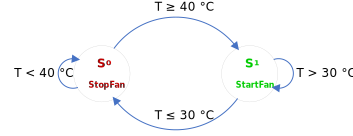
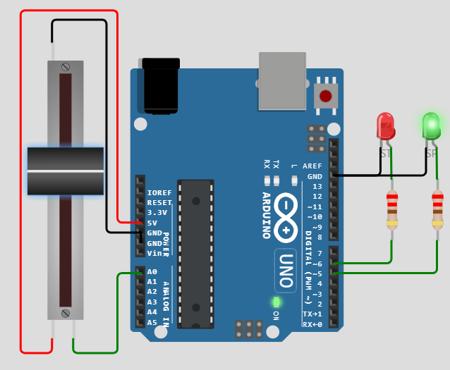
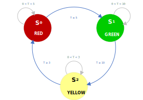
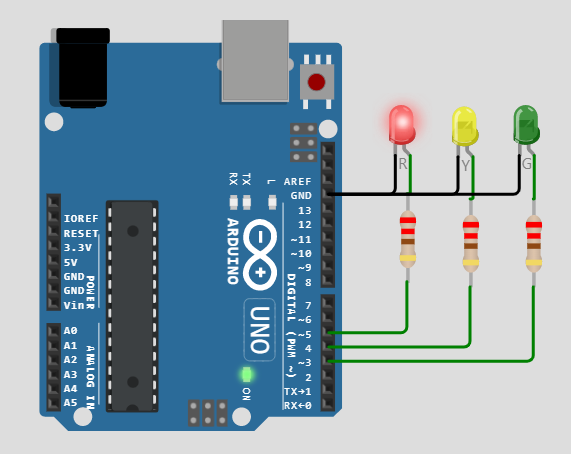

<p align="center">
	
  <h1 align="center">Finite-State</h1>
</p>

# Finite-State For Arduino
Finite-State provides a bounded state machine that combines `state transitions`, which has the following part:

- [Initial State](#initial-state)
- [Predicate Function (Input)](#predicate-function-input)
- [Target](#target)
- [State Functon (Output)](#state-function-output)
- [Event](#event-function)

```C
typedef struct {
  PredicateFunc predicateFunc;  // Predicate Function
  id_t current;                 // Current State
  id_t next;                    // Next State
  StateFunc stateFunc;          // State Function
  EventFunc eventFunc;          // Event Function
} Transition;
```
## Initial State
The Finite-State require to initial with an initial id.

```C
void begin(const id_t id);
```

Example:
```C
objectName.begin(3);  // FSM begins with Initial Transition Id 3
```

## Predicate Function (Input)

A Predicate Function will determine whether the specified object meets the criteria.

```C
typedef bool (*PredicateFunc)(id_t);    //  Predicate Function Pointer
```

The following function accepts `id` from a caller; type is a parameter of type `id_t`. The return type is `boolean`. It will be used to determine a Target for the ***current state*** and ***next state***:

```C
bool PredicateFunction(id_t id);       //  Predicate Function
```


## Target
A Target has two destinations:

  1. **Current State**

     A **Current State** will be defined by the Id number when the return value from Predicate function is `FALSE`.

  2. **Next State** 

     A **Next State** will be defined by the Id number when the return value from Predicate function is `TRUE`.


## State Function (Output)
The State Function is a function to implement Input/Output control, read/write data, etc.

```C
typedef void (*StateFunc)(State);       //  State Function Pointer
```

The following function accepts `state` from a caller; type is parameters of type `State`:

```C
void StateFunction(State state);       //  State Function
```
State:
```C
typedef struct {
  id_t id;          // State id
  bool firstScan;   // First Scan when State Activated
} State;
```
NOTE: The Id can also be obtained from `objectName.id`.
```C
id_t id = finiteStateMachine.id;
```

## Event Function
An Event Function is an option. Finite-State will handle events when the state changes for `ENTRY` and `EXIT` actions.


```C
typedef void (*EventFunc)(EventArgs);   //  Event Function Pointer
```

The following function accepts `state` from a caller; type is parameters of type `State`:

```C
void EventFunction(State state);       //  Event Function
```

EventArgs:

```C
typedef struct {
  id_t id;          // State id
  Events event;     // Event State
} EventArgs;
```

Events:
```C
enum Events : int8_t {
  LOOP,
  EXIT,
  ENTRY,
};
```

# Examples
## Fan Control With A Thermostat


<p align="center">
	
  <h3 align="center">State Diagram</h3>
</p>


<p align="center">
	 
  <h3 align="center">Wiring Diagram</h3>
</p>


### State-Transition Table
|Id|Predicate (Input)|Current State|Next State|State (Output)|Event|
|:-----|:-----|:-----:|:-----:|:-----|:-----|
|0|`FanStartPredicate`|0|1|`StartFan`|`nullptr`|
|1|`FanStopPredicate`|1|0|`StopFan`|`nullptr`|

### State-Transition Table -> Transition Declaration
```C
Transition transitions[] = {
  {FanStartPredicate, 0, 1, StartFan}, // State-0 -  Current-State = 0, Next-State = 1
  {FanStopPredicate, 1, 0, StopFan}    // State-1 -  Current-State = 1, Next-State = 0
};
```

### Sketch
```C
#include "FiniteState.h"

#define thermostatPin   A0
#define startStatusPin  5
#define stopStatusPin   6


uint8_t statusPins[] = {stopStatusPin, startStatusPin};
const uint8_t numberOfStatus = sizeof(statusPins) / sizeof(uint8_t);

void StartFan(State state);
void StopFan(State state);
bool FanStartPredicate(id_t state);
bool FanStopPredicate(id_t state);

Transition transitions[] = {
  {FanStartPredicate, 0, 1, StartFan}, // State-0 -  Current-State = 0, Next-State = 1
  {FanStopPredicate, 1, 0, StopFan}    // State-1 -  Current-State = 1, Next-State = 0
};
const uint8_t numberOfTransitions = sizeof(transitions) / sizeof(Transition);

FiniteState finiteStateMachine(transitions, numberOfTransitions); // Finite-State Object

const long ThermostatRead();
void FanControl(id_t id);

long temperature;

void setup() {
  for (uint8_t index = 0; index < numberOfStatus; index++) {
    pinMode(statusPins[index], OUTPUT);
    digitalWrite(statusPins[index], LOW);
  }

  finiteStateMachine.begin(0);    // FSM begins with Initial Transition Id 0
}

void loop() {
  finiteStateMachine.execute();   // Execute the FSM
  temperature = ThermostatRead(); // Read temperature
}

bool FanStartPredicate(id_t state) {
  return temperature >= 40;       // Determine Fan Start Action
}

void StartFan(State state) {
  FanControl(state.id);           // Fan control output
}

bool FanStopPredicate(id_t state) {
  return temperature <= 30;       // Determine Fan Stop Action
}

void StopFan(State state) {
  FanControl(state.id);           // Fan control output
}

void FanControl(id_t id) {
  for (uint8_t index = 0; index < numberOfStatus; index++) {
    bool value = index == id;
    digitalWrite(statusPins[index], value);  // Update Status
  }
}

const long ThermostatRead() {
  long value = analogRead(thermostatPin); // Read Pushbutton Value
  return map(value, 0, 1023, 0, 100);     // Scaling temperature
}
```

## Traffic Light


<p align="center">
	
  <h3 align="center">State Diagram</h3>
</p>


<p align="center">
	 
  <h3 align="center">Wiring Diagram</h3>
</p>


### State-Transition Table
|Id|Predicate (Input)|Current State|Next State|State (Output)|Event|
|:-----|:-----|:-----:|:-----:|:-----|:-----|
|0|`Inputs`|0|1|nullptr|EventStates|
|1|`Inputs`|1|2|nullptr|EventStates|
|2|`Inputs`|2|0|nullptr|EventStates|

### State-Transition Table -> Transition Declaration
```C
Transition transitions[] = {
  {Inputs, 0, 1, nullptr, EventStates}, // State-0 -  Current-State = 0, Next-State = 1
  {Inputs, 1, 2, nullptr, EventStates}, // State-1 -  Current-State = 1, Next-State = 2
  {Inputs, 2, 0, nullptr, EventStates}, // State-2 -  Current-State = 2, Next-State = 0
};
```

### Sketch
```C
#include "FiniteState.h"

#define redLightPin     5
#define yellowLightPin  4
#define greenLightPin   3

uint8_t lightPins[] = {redLightPin, greenLightPin, yellowLightPin}; // Define an array of light pins.
const uint8_t numberOfLights = sizeof(lightPins) / sizeof(uint8_t); // Calculate the number of lights.

typedef struct {
  unsigned long delayTime;
  unsigned long startTime;
} Timer;

Timer delayTimes[] = {
  {5000},   // RED Delay Time 5 seconds
  {10000},  // GREEN Delay Time 10 seconds
  {3000},   // YELLOW Delay Time 3 seconds
};

bool Inputs(id_t id);           // Predicate (Input)
void EventStates(EventArgs e);  // Event State

Transition transitions[] = {
  {Inputs, 0, 1, nullptr, EventStates}, // State-0 -  Current-State = 0, Next-State = 1
  {Inputs, 1, 2, nullptr, EventStates}, // State-1 -  Current-State = 1, Next-State = 2
  {Inputs, 2, 0, nullptr, EventStates}, // State-2 -  Current-State = 2, Next-State = 0
};
const uint8_t numberOftransitions = sizeof(transitions) / sizeof(Transition); // Calculate the number of transitions.

FiniteState finiteStateMachine(transitions, numberOftransitions);             // Define Finite-State Object

void setup() {
  for (uint8_t index = 0; index < numberOfLights; index ++) {
    pinMode(lightPins[index], OUTPUT);    // Set Pin Mode
    digitalWrite(lightPins[index], LOW);  // Set Light with the LOW state.
  }
  finiteStateMachine.begin(0);            // FSM begins with Initial Transition Id 0
}

void loop() {
  finiteStateMachine.execute();  // Execute the FSM
}

bool Inputs(id_t id) {
  return (millis() - delayTimes[id].startTime >= delayTimes[id].delayTime); // Determine Time Delay
}

void EventStates(EventArgs e) {
  switch (e.event) {
    case ENTRY:
      delayTimes[e.id].startTime  = millis(); // Reload start time
      digitalWrite(lightPins[e.id], HIGH);    // Set Light with the HIGH state.
      break;
    case EXIT:
      digitalWrite(lightPins[e.id], LOW);     // Set Light with the LOW state.
      break;
  }
}
```