<p align="center">
	
  <h1 align="center">Finite-State</h1>
</p>

# Finite-State Machine for Arduino
Finite-State provides a bounded state machine that combines `state transitions`, which has the following parts:

- [Predicate Function](#predicate-function)
- [Next State](#next-state)
- [Process Function](#process-function)
- [Event Handler Function](#event-handler-function)
- [Timer](#timer)

<p align="center">
	
  <h3 align="center"></h3>
</p>

```C
typedef struct {
  Predicate predicate;                  // Predicate Function Pointer
  id_t nextF;                           // Next State on FALSE
  id_t nextT;                           // Next State on TRUE
  Process process;                      // Process Function Pointer
  EventHandler eventHandler;            // Event Function Pointer
  time_t delayTime;                     // Delay Time
  TimerType timerType;                  // Timer Type
} Transition;
```

## Predicate Function

A Predicate Function will determine whether the specified object meets the criteria.

```C
typedef bool (*Predicate)(id_t);        //  Predicate Function Pointer
```

The following function accepts `id` from a caller; type is a parameter of type `id_t`. The return type is `boolean`. It will be used to determine a Next-State for the ***NextF*** and ***nextT***:

Syntax:

```C
bool PredicateCallbackFunction(id_t id);  //  Predicate Callback Function
```

Example:

```C
bool PredicateCallbackFunction(id_t id) {
  // TODO: PREDICATE FUNCTION
  
  return button[id].isPressed(); 
}
```

Or,

```C
bool PredicateCallbackFunction(id_t id) {
  // TODO: PREDICATE FUNCTION
  
  return array[id] == 10; 
}
```

## Next State

A Next-State has two destinations:

  1. **Next State On FALSE (`nextF`)**

     A **nextF** will be defined by the Id number when the return value from the condition of the Timer and Predicate function is `FALSE`.

  2. **Next State On TRUE (`nextT`)** 

     A **Next State On TURE** will be defined by the Id number when the return value from the condition of the Timer and Predicate function is `TRUE`.


## Process Function

The Process Function is a function to implement Input/Output control, read/write data, etc.

```C
typedef void (*Process)(id_t);                //  Process Function Pointer
```

The following function accepts `id` from a caller; type is parameters of type `id_t`:

Syntax:

```C
void ProcessCallbackFunction(id_t id);       //  Process Callback Function
```

Example:

```C
void MotorProcess(id_t id) {
  StatusState status;

  if (motor[id].timerON) {
    if (motor[id].running) {
      status = RUNNING;
    } else {
      status = FAULT;
    }
    digitalWrite(motor[id].faultPin, status == FAULT);
  }
}
```

NOTE: The Id can also be obtained from `objectName.id`.

```C
id_t id = finiteStateMachine.id;
```

## Event Handler Function

An Event Handler Function is an option. Finite-State will handle events when the state changes for `ENTRY`, `DURINT`, and `EXIT` actions.

```C
typedef void (*EventHandler)(EventArgs);    //  Event Handler Function Pointer
```

EventArgs:

```C
typedef struct {
  id_t id;          // State id
  Action action;    // Action State
} EventArgs;
```

Action:

```C
enum Action {
  NONE,
  EXIT,
  ENTRY
};
```

The following function accepts `id_t`, and `Action` from a caller; type is the parameters of type `EventArgs`:

Syntax:

```C
void EventCallbackFunction(EventArgs e);   //  Event Callback Function
```

Example:

```C
void EvnetOnActionChanged(EventArgs e) {
  switch (e.action) {
    case ENTRY:
      digitalWrite(motor[e.id].output, true);
      break;
    case EXIT:
      digitalWrite(motor[e.id].output, false);
      break;
  }
}
```

## Timer

A Timer is an option. Finite-State will predict the condition for the next state with a timer when the timer type selects and the delay time value is greater than zero.
- [Not Used Timer (`NOT_USED`)](#not-used-timer-not_used)
- [Transition Timer (`TRANS_TIMER`)](#transition-timer-trans_timer)
- [Predicate Timer (`PREDIC_TIMER`)](#predicate-timer-predic_timer)
- [False-State Timer (`FALSE_TIMER`)](#false-state-timer-false_timer)
- [True-State Timer (`TRUE_TIMER`)](#true-state-timer-true_timer)

```c
enum TimerType {
  NOT_USED,       // Not Used Timer
  TRANS_TIMER,    // Transition Timer
  PREDIC_TIMER,   // Predicate Timer
  FALSE_TIMER,    // False State Timer
  TRUE_TIMER,     // True State Timer
};
```

### Not Used Timer (`NOT_USED`)

When Timer is not used, The predicate function is non `nullptr`. The Predicate function's return value determines the condition for the next state.

<p align="center">
	
  <h3 align="center">Not-Used Timer State Diagram</h3>
</p>

State transitions can be defined as three options,
- [Predicate Function with Process and Event](#predicate-function-with-process-and-event)
- [Predicate Function with Process](#predicate-function-with-process)
- [Predicate Function with Event](#predicate-function-with-event)

#### Predicate Function with Process and Event

<p align="center">
	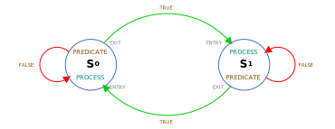
  <h3 align="center">Typical Predicate Function with Process and Event State Diagram</h3>
</p>

##### State-Transition Table

|Id|Predicate|Next State - F|Next State - T|Process|Event|Delay Time (mS)| Timer Type|
|:-----|:-----|:-----:|:-----:|:-----|:-----|-----:|:-----|
|`0`|`InputPredicate`|`0`|`1`|`OutputProcess`|`EventOnActionChanged`|`-`|`-`|
|`1`|`InputPredicate`|`1`|`0`|`OutputProcess`|`EventOnActionChanged`|`-`|`-`|

#### State-Transition Declaration

```C
bool InputPredicate(id_t id);
void OutputProcess(id_t id);
void EventOnActionChanged(EventArgs e);

Transition transitions[] = {
  {InputPredicate, 0, 1, OutputProcess, EventOnActionChanged},                  // State-0 - NextF = 0, NextT = 1
  {InputPredicate, 1, 0, OutputProcess, EventOnActionChanged}                   // State-1 - NextF = 1, NextT = 0
};
const uint8_t numberOfTransitions = sizeof(transitions) / sizeof(Transition);   // Number of Transitions

FiniteState finiteStateMachine(transitions, numberOfTransitions);               // Finite-State Object
```

#### Predicate Function with Process

<p align="center">
	
  <h3 align="center">Typical Predicate Function with Process State Diagram</h3>
</p>

##### State-Transition Table

|Id|Predicate|Next State - F|Next State - T|Process|Event|Delay Time (mS)| Timer Type|
|:-----|:-----|:-----:|:-----:|:-----|:-----|-----:|:-----|
|`0`|`InputPredicate`|`0`|`1`|`OutputProcess`|`-`|`-`|`-`|
|`1`|`InputPredicate`|`1`|`0`|`OutputProcess`|`-`|`-`|`-`|

#### State-Transition Declaration

```C
bool InputPredicate(id_t id);
void OutputProcess(id_t id);

Transition transitions[] = {
  {InputPredicate, 0, 1, OutputProcess},                                        // State-0 - NextF = 0, NextT = 1
  {InputPredicate, 1, 0, OutputProcess}                                         // State-1 - NextF = 1, NextT = 0
};
const uint8_t numberOfTransitions = sizeof(transitions) / sizeof(Transition);   // Number of Transitions

FiniteState finiteStateMachine(transitions, numberOfTransitions);               // Finite-State Object
```

#### Predicate Function with Event

<p align="center">
	
  <h3 align="center">Typical Predicate Function with Event State Diagram</h3>
</p>

##### State-Transition Table

|Id|Predicate|Next State - F|Next State - T|Process|Event|Delay Time (mS)| Timer Type|
|:-----|:-----|:-----:|:-----:|:-----|:-----|-----:|:-----|
|`0`|`InputPredicate`|`0`|`1`|`-`|`EventOnActionChanged`|`-`|`-`|
|`1`|`InputPredicate`|`1`|`0`|`-`|`EventOnActionChanged`|`-`|`-`|

#### State-Transition Declaration

```C
bool InputPredicate(id_t id);
void EventOnActionChanged(EventArgs e);

Transition transitions[] = {
  {InputPredicate, 0, 1, nullptr, EventOnActionChanged},                        // State-0 - NextF = 0, NextT = 1
  {InputPredicate, 1, 0, nullptr, EventOnActionChanged}                         // State-1 - NextF = 1, NextT = 0
};
const uint8_t numberOfTransitions = sizeof(transitions) / sizeof(Transition);   // Number of Transitions

FiniteState finiteStateMachine(transitions, numberOfTransitions);               // Finite-State Object
```

### Transition Timer (`TRANS_TIMER`)

When selecting the transition timer, the condition for the next state will ignore the Predicate function's return value. It is the only `NextT` condition possible during the timer timeout.

<p align="center">
	
  <h3 align="center">Transition-Timer State Diagram</h3>
</p>

State transitions can be defined as three options,
- [Transition Timer with Process and Event](#transition-timer-with-process-and-event)
- [Transition Timer with Process](#transition-timer-with-process)
- [Transition Timer with Event](#transition-timer-with-event)


#### Transition Timer with Process and Event

<p align="center">
	
  <h3 align="center">Typical Transition Timer with Process and Event State Diagram</h3>
</p>

##### State-Transition Table

|Id|Predicate|Next State - F|Next State - T|Process|Event|Delay Time (mS)| Timer Type|
|:-----|:-----|:-----:|:-----:|:-----|:-----|-----:|:-----|
|`0`|`-`|`0`|`1`|`OutputProcess`|`EventOnActionChanged`|`1,000`|`TRANS_TIMER`|
|`1`|`-`|`1`|`0`|`OutputProcess`|`EventOnActionChanged`|`1,000`|`TRANS_TIMER`|

#### State-Transition Declaration

```C
void OutputProcess(id_t id);
void EventOnActionChanged(EventArgs e);

Transition transitions[] = {
  {nullptr, 0, 1, OutputProcess, EventOnActionChanged, 1000, TRANS_TIMER},      // State-0 - NextF = 0, NextT = 1
  {nullptr, 1, 0, OutputProcess, EventOnActionChanged, 1000, TRANS_TIMER}       // State-1 - NextF = 1, NextT = 0
};
const uint8_t numberOfTransitions = sizeof(transitions) / sizeof(Transition);   // Number of Transitions

FiniteState finiteStateMachine(transitions, numberOfTransitions);               // Finite-State Object
```

#### Transition Timer with Process

<p align="center">
	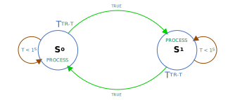
  <h3 align="center">Typical Transition Timer with Process State Diagram</h3>
</p>

##### State-Transition Table

|Id|Predicate|Next State - F|Next State - T|Process|Event|Delay Time (mS)| Timer Type|
|:-----|:-----|:-----:|:-----:|:-----|:-----|-----:|:-----|
|`0`|`-`|`0`|`1`|`OutputProcess`|`-`|`1,000`|`TRANS_TIMER`|
|`1`|`-`|`1`|`0`|`OutputProcess`|`-`|`1,000`|`TRANS_TIMER`|

#### State-Transition Declaration

```C
void OutputProcess(id_t id);

Transition transitions[] = {
  {nullptr, 0, 1, OutputProcess, nullptr, 1000, TRANS_TIMER},                   // State-0 - NextF = 0, NextT = 1
  {nullptr, 1, 0, OutputProcess, nullptr, 1000, TRANS_TIMER}                    // State-1 - NextF = 1, NextT = 0
};
const uint8_t numberOfTransitions = sizeof(transitions) / sizeof(Transition);   // Number of Transitions

FiniteState finiteStateMachine(transitions, numberOfTransitions);               // Finite-State Object
```

#### Transition Timer with Event

<p align="center">
	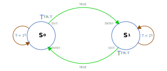
  <h3 align="center">Typical Transition Timer with Event State Diagram</h3>
</p>

##### State-Transition Table

|Id|Predicate|Next State - F|Next State - T|Process|Event|Delay Time (mS)| Timer Type|
|:-----|:-----|:-----:|:-----:|:-----|:-----|-----:|:-----|
|`0`|`-`|`0`|`1`|`-`|`EventOnActionChanged`|`1,000`|`TRANS_TIMER`|
|`1`|`-`|`1`|`0`|`-`|`EventOnActionChanged`|`1,000`|`TRANS_TIMER`|

#### State-Transition Declaration

```C
void EventOnActionChanged(EventArgs e);

Transition transitions[] = {
  {nullptr, 0, 1, nullptr, EventOnActionChanged, 1000, TRANS_TIMER},            // State-0 - NextF = 0, NextT = 1
  {nullptr, 1, 0, nullptr, EventOnActionChanged, 1000, TRANS_TIMER}             // State-1 - NextF = 1, NextT = 0
};
const uint8_t numberOfTransitions = sizeof(transitions) / sizeof(Transition);   // Number of Transitions

FiniteState finiteStateMachine(transitions, numberOfTransitions);               // Finite-State Object
```

### Predicate Timer (`PREDIC_TIMER`)

When selecting the predicate timer, the condition for the next state will ignore the Predicate function's return value during the timer running. The Predicate function's return value will be used for the state selection when the timer timeout. The predicate function is non `nullptr`.

<p align="center">
	
  <h3 align="center">Predicate-Timer State Diagram</h3>
</p>

State transitions can be defined as three options,
- [Predicate Timer with Process and Event](#predicate-timer-with-process-and-event)
- [Predicate Timer with Process](#predicate-timer-with-process)
- [Predicate Timer with Event](#predicate-timer-with-event)


#### Predicate Timer with Process and Event

<p align="center">
	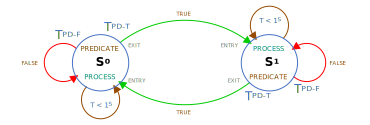
  <h3 align="center">Typical Predicate Timer with Process and Event State Diagram</h3>
</p>

##### State-Transition Table

|Id|Predicate|Next State - F|Next State - T|Process|Event|Delay Time (mS)| Timer Type|
|:-----|:-----|:-----:|:-----:|:-----|:-----|-----:|:-----|
|`0`|`InputPredicate`|`0`|`1`|`OutputProcess`|`EventOnActionChanged`|`1,000`|`PREDIC_TIMER`|
|`1`|`InputPredicate`|`1`|`0`|`OutputProcess`|`EventOnActionChanged`|`1,000`|`PREDIC_TIMER`|

#### State-Transition Declaration

```C
bool InputPredicate(id_t id);
void OutputProcess(id_t id);
void EventOnActionChanged(EventArgs e);

Transition transitions[] = {
  {InputPredicate, 0, 1, OutputProcess, EventOnActionChanged, 1000, PREDIC_TIMER},    // State-0 - NextF = 0, NextT = 1
  {InputPredicate, 1, 0, OutputProcess, EventOnActionChanged, 1000, PREDIC_TIMER}     // State-1 - NextF = 1, NextT = 0
};
const uint8_t numberOfTransitions = sizeof(transitions) / sizeof(Transition);         // Number of Transitions

FiniteState finiteStateMachine(transitions, numberOfTransitions);                     // Finite-State Object
```

#### Predicate Timer with Process

<p align="center">
	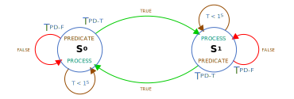
  <h3 align="center">Typical Predicate Timer with Process and Event State Diagram</h3>
</p>

##### State-Transition Table

|Id|Predicate|Next State - F|Next State - T|Process|Event|Delay Time (mS)| Timer Type|
|:-----|:-----|:-----:|:-----:|:-----|:-----|-----:|:-----|
|`0`|`InputPredicate`|`0`|`1`|`OutputProcess`|`-`|`1,000`|`PREDIC_TIMER`|
|`1`|`InputPredicate`|`1`|`0`|`OutputProcess`|`-`|`1,000`|`PREDIC_TIMER`|

#### State-Transition Declaration

```C
bool InputPredicate(id_t id);
void OutputProcess(id_t id);

Transition transitions[] = {
  {InputPredicate, 0, 1, OutputProcess, nullptr, 1000, PREDIC_TIMER},           // State-0 - NextF = 0, NextT = 1
  {InputPredicate, 1, 0, OutputProcess, nullptr, 1000, PREDIC_TIMER}            // State-1 - NextF = 1, NextT = 0
};
const uint8_t numberOfTransitions = sizeof(transitions) / sizeof(Transition);   // Number of Transitions

FiniteState finiteStateMachine(transitions, numberOfTransitions);               // Finite-State Object
```

#### Predicate Timer with Event

<p align="center">
	
  <h3 align="center">Typical Predicate Timer with Event State Diagram</h3>
</p>

##### State-Transition Table

|Id|Predicate|Next State - F|Next State - T|Process|Event|Delay Time (mS)| Timer Type|
|:-----|:-----|:-----:|:-----:|:-----|:-----|-----:|:-----|
|`0`|`InputPredicate`|`0`|`1`|`-`|`EventOnActionChanged`|`1,000`|`PREDIC_TIMER`|
|`1`|`InputPredicate`|`1`|`0`|`-`|`EventOnActionChanged`|`1,000`|`PREDIC_TIMER`|

#### State-Transition Declaration

```C
bool InputPredicate(id_t id);
void EventOnActionChanged(EventArgs e);

Transition transitions[] = {
  {InputPredicate, 0, 1, nullptr, EventOnActionChanged, 1000, PREDIC_TIMER},    // State-0 - NextF = 0, NextT = 1
  {InputPredicate, 1, 0, nullptr, EventOnActionChanged, 1000, PREDIC_TIMER}     // State-1 - NextF = 1, NextT = 0
};
const uint8_t numberOfTransitions = sizeof(transitions) / sizeof(Transition);   // Number of Transitions

FiniteState finiteStateMachine(transitions, numberOfTransitions);               // Finite-State Object
```

### False-State Timer (`FALSE_TIMER`)

When selecting the false-state timer, the condition for the next state will ignore the Predicate function's `False` value except for the `True` deal during the timer running. The state will be accepted the "False" when the timer timeout. The predicate function is non `nullptr`.

<p align="center">
	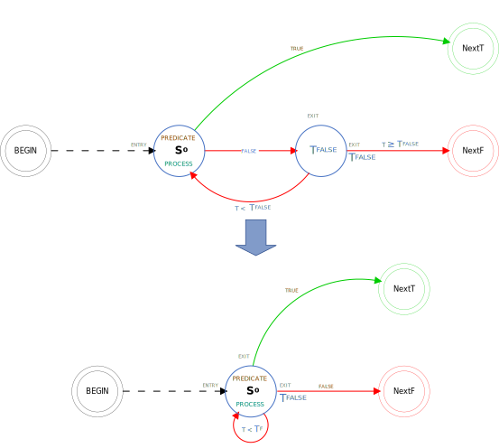
  <h3 align="center">False-Timer State Diagram</h3>
</p>

State transitions can be defined as three options,
- [False Timer with Process and Event](#false-timer-with-process-and-event)
- [False Timer with Process](#false-timer-with-process)
- [False Timer with Event](#false-timer-with-event)


#### False Timer with Process and Event

<p align="center">
	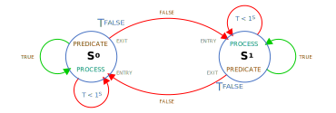
  <h3 align="center">Typical False Timer with Process State Diagram</h3>
</p>

##### State-Transition Table

|Id|Predicate|Next State - F|Next State - T|Process|Event|Delay Time (mS)| Timer Type|
|:-----|:-----|:-----:|:-----:|:-----|:-----|-----:|:-----|
|`0`|`InputPredicate`|`0`|`1`|`OutputProcess`|`EventOnActionChanged`|`1,000`|`FALSE_TIMER`|
|`1`|`InputPredicate`|`1`|`0`|`OutputProcess`|`EventOnActionChanged`|`1,000`|`FALSE_TIMER`|

#### State-Transition Declaration

```C
bool InputPredicate(id_t id);
void OutputProcess(id_t id);
void EventOnActionChanged(EventArgs e);

Transition transitions[] = {
  {InputPredicate, 0, 1, OutputProcess, EventOnActionChanged, 1000, FALSE_TIMER},     // State-0 - NextF = 0, NextT = 1
  {InputPredicate, 1, 0, OutputProcess, EventOnActionChanged, 1000, FALSE_TIMER}      // State-1 - NextF = 1, NextT = 0
};
const uint8_t numberOfTransitions = sizeof(transitions) / sizeof(Transition);         // Number of Transitions

FiniteState finiteStateMachine(transitions, numberOfTransitions);                     // Finite-State Object
```

#### False Timer with Process

<p align="center">
	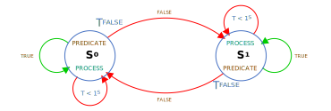
  <h3 align="center">Typical False Timer with Process State Diagram</h3>
</p>

##### State-Transition Table

|Id|Predicate|Next State - F|Next State - T|Process|Event|Delay Time (mS)| Timer Type|
|:-----|:-----|:-----:|:-----:|:-----|:-----|-----:|:-----|
|`0`|`InputPredicate`|`0`|`1`|`OutputProcess`|`-`|`1,000`|`FALSE_TIMER`|
|`1`|`InputPredicate`|`1`|`0`|`OutputProcess`|`-`|`1,000`|`FALSE_TIMER`|

#### State-Transition Declaration

```C
bool InputPredicate(id_t id);
void OutputProcess(id_t id);

Transition transitions[] = {
  {InputPredicate, 0, 1, OutputProcess, nullptr, 1000, FALSE_TIMER},            // State-0 - NextF = 0, NextT = 1
  {InputPredicate, 1, 0, OutputProcess, nullptr, 1000, FALSE_TIMER}             // State-1 - NextF = 1, NextT = 0
};
const uint8_t numberOfTransitions = sizeof(transitions) / sizeof(Transition);   // Number of Transitions

FiniteState finiteStateMachine(transitions, numberOfTransitions);               // Finite-State Object
```

#### False Timer with Event

<p align="center">
	
  <h3 align="center">Typical False Timer with Event State Diagram</h3>
</p>

##### State-Transition Table

|Id|Predicate|Next State - F|Next State - T|Process|Event|Delay Time (mS)| Timer Type|
|:-----|:-----|:-----:|:-----:|:-----|:-----|-----:|:-----|
|`0`|`InputPredicate`|`0`|`1`|`-`|`EventOnActionChanged`|`1,000`|`FALSE_TIMER`|
|`1`|`InputPredicate`|`1`|`0`|`-`|`EventOnActionChanged`|`1,000`|`FALSE_TIMER`|

#### State-Transition Declaration

```C
bool InputPredicate(id_t id);
void EventOnActionChanged(EventArgs e);

Transition transitions[] = {
  {InputPredicate, 0, 1, nullptr, EventOnActionChanged, 1000, FALSE_TIMER},     // State-0 - NextF = 0, NextT = 1
  {InputPredicate, 1, 0, nullptr, EventOnActionChanged, 1000, FALSE_TIMER}      // State-1 - NextF = 1, NextT = 0
};
const uint8_t numberOfTransitions = sizeof(transitions) / sizeof(Transition);   // Number of Transitions

FiniteState finiteStateMachine(transitions, numberOfTransitions);               // Finite-State Object
```

### True-State Timer (`TRUE_TIMER`)

When selecting the true-state timer, the condition for the next state will ignore the Predicate function's `True` value except for the `False` deal during the timer running. The state will be accepted the `True` when the timer timeout. The predicate function is non `nullptr`.

<p align="center">
	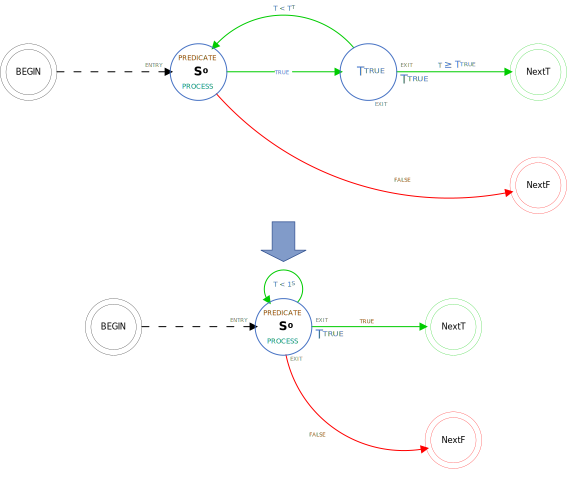
  <h3 align="center">False-Timer State Diagram</h3>
</p>

State transitions can be defined as three options,
- [True Timer with Process and Event](#true-timer-with-process-and-event)
- [True Timer with Process](#true-timer-with-process)
- [True Timer with Event](#true-timer-with-event)


#### True Timer with Process and Event

<p align="center">
	
  <h3 align="center">Typical True Timer with Process and event State Diagram</h3>
</p>

##### State-Transition Table

|Id|Predicate|Next State - F|Next State - T|Process|Event|Delay Time (mS)| Timer Type|
|:-----|:-----|:-----:|:-----:|:-----|:-----|-----:|:-----|
|`0`|`InputPredicate`|`0`|`1`|`OutputProcess`|`EventOnActionChanged`|`1,000`|`TRUE_TIMER`|
|`1`|`InputPredicate`|`1`|`0`|`OutputProcess`|`EventOnActionChanged`|`1,000`|`TRUE_TIMER`|

#### State-Transition Declaration

```C
bool InputPredicate(id_t id);
void OutputProcess(id_t id);
void EventOnActionChanged(EventArgs e);

Transition transitions[] = {
  {InputPredicate, 0, 1, OutputProcess, EventOnActionChanged, 1000, TRUE_TIMER},    // State-0 - NextF = 0, NextT = 1
  {InputPredicate, 1, 0, OutputProcess, EventOnActionChanged, 1000, TRUE_TIMER}     // State-1 - NextF = 1, NextT = 0
};
const uint8_t numberOfTransitions = sizeof(transitions) / sizeof(Transition);       // Number of Transitions

FiniteState finiteStateMachine(transitions, numberOfTransitions);                   // Finite-State Object
```

#### True Timer with Process

<p align="center">
	
  <h3 align="center">Typical True Timer with Process State Diagram</h3>
</p>

##### State-Transition Table

|Id|Predicate|Next State - F|Next State - T|Process|Event|Delay Time (mS)| Timer Type|
|:-----|:-----|:-----:|:-----:|:-----|:-----|-----:|:-----|
|`0`|`InputPredicate`|`0`|`1`|`OutputProcess`|`-`|`1,000`|`TRUE_TIMER`|
|`1`|`InputPredicate`|`1`|`0`|`OutputProcess`|`-`|`1,000`|`TRUE_TIMER`|

#### State-Transition Declaration

```C
bool InputPredicate(id_t id);
void OutputProcess(id_t id);

Transition transitions[] = {
  {InputPredicate, 0, 1, OutputProcess, nullptr, 1000, TRUE_TIMER},             // State-0 - NextF = 0, NextT = 1
  {InputPredicate, 1, 0, OutputProcess, nullptr, 1000, TRUE_TIMER}              // State-1 - NextF = 1, NextT = 0
};
const uint8_t numberOfTransitions = sizeof(transitions) / sizeof(Transition);   // Number of Transitions

FiniteState finiteStateMachine(transitions, numberOfTransitions);               // Finite-State Object
```

#### True Timer with Event

<p align="center">
	
  <h3 align="center">Typical True Timer with Event State Diagram</h3>
</p>

##### State-Transition Table

|Id|Predicate|Next State - F|Next State - T|Process|Event|Delay Time (mS)| Timer Type|
|:-----|:-----|:-----:|:-----:|:-----|:-----|-----:|:-----|
|`0`|`InputPredicate`|`0`|`1`|`-`|`EventOnActionChanged`|`1,000`|`TRUE_TIMER`|
|`1`|`InputPredicate`|`1`|`0`|`-`|`EventOnActionChanged`|`1,000`|`TRUE_TIMER`|

#### State-Transition Declaration

```C
bool InputPredicate(id_t id);
void EventOnActionChanged(EventArgs e);

Transition transitions[] = {
  {InputPredicate, 0, 1, nullptr, EventOnActionChanged, 1000, TRUE_TIMER},      // State-0 - NextF = 0, NextT = 1
  {InputPredicate, 1, 0, nullptr, EventOnActionChanged, 1000, TRUE_TIMER}       // State-1 - NextF = 1, NextT = 0
};
const uint8_t numberOfTransitions = sizeof(transitions) / sizeof(Transition);   // Number of Transitions

FiniteState finiteStateMachine(transitions, numberOfTransitions);               // Finite-State Object
```

# Example

## Fan Control With A Thermostat

<p align="center">
	
  <h3 align="center">State Diagram</h3>
</p>

<p align="center">
	 
  <h3 align="center">Wiring Diagram</h3>
</p>

#### State-Transition Table Table

|State|Id|Predicate|Next State - F|Next State - T|Process|Event|Delay Time (mS)| Timer Type|
|:-----|:-----:|:-----|:-----:|:-----:|:-----|:-----|-----:|:-----|
|`STOP`|`0`|`HighTempPredicate`|`0`|`1`|`FanStopProcess`|`-`|`-`|`-`|
|`START`|`1`|`LowTempPredicate`|`1`|`0`|`FanStartProcess`|`-`|`-`|`-`|

#### State-Transition Table Table -> Transition Declaration

```C
Transition transitions[] = {
  {HighTempPredicate, 0, 1, FanStopProcess},                                  // State-0 - NextF = 0, NextT = 1
  {LowTempPredicate, 1, 0, FanStartProcess}                                   // State-1 - NextF = 1, NextT = 0
};
const uint8_t numberOfTransitions = sizeof(transitions) / sizeof(Transition); // Number of Transitions
```

Or,

```C
enum FanState : id_t {
  STOP,
  START
};

Transition transitions[] = {
  {HighTempPredicate, STOP, START, FanStopProcess},                           // State-0 - NextF = 0, NextT = 1
  {LowTempPredicate, START, STOP, FanStartProcess}                            // State-1 - NextF = 1, NextT = 0
};
const uint8_t numberOfTransitions = sizeof(transitions) / sizeof(Transition); // Number of Transitions
```

#### Sketch 

 [Fan Control With A Thermostat](https://wokwi.com/projects/362184372922602497)

```C
#include "FiniteState.h"

#define thermostatPin   A0
#define startStatusPin  5
#define stopStatusPin   6

void FanStartProcess(id_t id);
void FanStopProcess(id_t id);
bool HighTempPredicate(id_t state);
bool LowTempPredicate(id_t state);

enum FanState : id_t {
  STOP,
  START
};

Transition transitions[] = {
  {HighTempPredicate, STOP, START, FanStopProcess},                           // State-0 - NextF = 0, NextT = 1
  {LowTempPredicate, START, STOP, FanStartProcess}                            // State-1 - NextF = 1, NextT = 0
};
const uint8_t numberOfTransitions = sizeof(transitions) / sizeof(Transition); // Number of Transitions

FiniteState finiteStateMachine(transitions, numberOfTransitions);             // Finite-State Object

const long ThermostatRead();

void setup() {
  pinMode(startStatusPin, OUTPUT);        // Set the start status pin mode
  pinMode(stopStatusPin, OUTPUT);         // Set the sotp status pin mode
  finiteStateMachine.begin(STOP);         // FSM begins with Initial Transition Id 0
}

void loop() {
  finiteStateMachine.execute();           // Execute the FSM
}

bool HighTempPredicate(id_t state) {
  return ThermostatRead() >= 40;          // Determine Fan Start Action
}

bool LowTempPredicate(id_t state) {
  return ThermostatRead() <= 30;          // Determine Fan Stop Action
}

void FanStartProcess(id_t id) {
  digitalWrite(stopStatusPin, false);     // Update fan stop status
  digitalWrite(startStatusPin, true);     // Update fan start status
}

void FanStopProcess(id_t id) {
  digitalWrite(startStatusPin, false);    // Update fan start status
  digitalWrite(stopStatusPin, true);      // Update fan stop status
}

const long ThermostatRead() {
  long value = analogRead(thermostatPin); // Read Pushbutton Value
  return map(value, 0, 1023, 0, 100);     // Scaling temperature
}
```

## Traffic Light

- [Traffic Light with Customized Timer (`NOT_USED`)](#traffic-light-with-customized-timer-not_used)

- [Traffic Light with Transition Timer (`TRANS_TIMER`)](#traffic-light-with-transition-timer-trans_timer)

### Traffic Light with Customized Timer (`NOT_USED`)

<p align="center">
	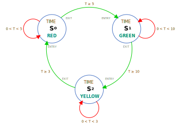
  <h3 align="center">State Diagram</h3>
</p>

<p align="center">
	 
  <h3 align="center">Wiring Diagram</h3>
</p>

#### State-Transition Table Table

|State|Id|Predicate|Next State - F|Next State - T|Process|Event|Delay Time (mS)| Timer Type|
|:-----|:-----:|:-----|:-----:|:-----:|:-----|:-----|-----:|:-----|
|`RED`|`0`|`TimePredicate`|`0`|`1`|`-`|`EventOnActionChanged`|`-`|`-`|
|`GREEN`|`1`|`TimePredicate`|`1`|`2`|`-`|`EventOnActionChanged`|`-`|`-`|
|`YELLOW`|`2`|`TimePredicate`|`2`|`0`|`-`|`EventOnActionChanged`|`-`|`-`|

#### State-Transition Table Table -> Transition Declaration

```C
Transition transitions[] = {
  {TimePredicate, 0, 1, nullptr, EventOnActionChanged},                       // State-1 - NextF = 0, NextT = 1
  {TimePredicate, 1, 2, nullptr, EventOnActionChanged},                       // State-2 - NextF = 1, NextT = 2
  {TimePredicate, 2, 0, nullptr, EventOnActionChanged},                       // State-3 - NextF = 2, NextT = 0
};
const uint8_t numberOfTransitions = sizeof(transitions) / sizeof(Transition); // Calculate the number of transitions.
```

Or,

```C
enum TraficState {
  RED,
  GREEN,
  YELLOW
};

Transition transitions[] = {
  {TimePredicate, RED, GREEN, nullptr, EventOnActionChanged},                 // State-1 - NextF = 0, NextT = 1
  {TimePredicate, GREEN, YELLOW, nullptr, EventOnActionChanged},              // State-2 - NextF = 1, NextT = 2
  {TimePredicate, YELLOW, RED, nullptr, EventOnActionChanged},                // State-3 - NextF = 2, NextT = 0
};
const uint8_t numberOfTransitions = sizeof(transitions) / sizeof(Transition); // Calculate the number of transitions.
```

#### Sketch

 [Traffic Light with Customized Timer](https://wokwi.com/projects/362092485127898113)


```C
#include "FiniteState.h"

#define redLightPin     5
#define yellowLightPin  4
#define greenLightPin   3

uint8_t lightPins[] = {redLightPin, greenLightPin, yellowLightPin}; // Define an array of light pins.
const uint8_t numberOfLights = sizeof(lightPins) / sizeof(uint8_t); // Calculate the number of lights.

typedef struct {
  unsigned long delayTime;
  unsigned long startTime;
} Timer;

Timer delayTimes[] = {
  {5000},   // RED Delay Time 5 seconds
  {10000},  // GREEN Delay Time 10 seconds
  {3000},   // YELLOW Delay Time 3 seconds
};

bool TimePredicate(id_t id);              // Predicate (Input)
void EventOnActionChanged(EventArgs e);   // Event State

enum TraficState {
  RED,
  GREEN,
  YELLOW
};

Transition transitions[] = {
  {TimePredicate, RED, GREEN, nullptr, EventOnActionChanged},                 // State-1 - NextF = 0, NextT = 1
  {TimePredicate, GREEN, YELLOW, nullptr, EventOnActionChanged},              // State-2 - NextF = 1, NextT = 2
  {TimePredicate, YELLOW, RED, nullptr, EventOnActionChanged},                // State-3 - NextF = 2, NextT = 0
};
const uint8_t numberOfTransitions = sizeof(transitions) / sizeof(Transition); // Calculate the number of transitions.

FiniteState finiteStateMachine(transitions, numberOfTransitions);             // Define Finite-State Object

void setup() {
  for (uint8_t index = 0; index < numberOfLights; index ++) {
    pinMode(lightPins[index], OUTPUT);    // Set Pin Mode
    digitalWrite(lightPins[index], LOW);  // Set Light with the LOW state.
  }
  finiteStateMachine.begin(RED);          // FSM begins with Initial Transition Id 0
}

void loop() {
  finiteStateMachine.execute();           // Execute the FSM
}

bool TimePredicate(id_t id) {
  return (millis() - delayTimes[id].startTime >= delayTimes[id].delayTime); // Determine Time Delay
}

void EventOnActionChanged(EventArgs e) {
  switch (e.action) {
    case ENTRY:
      delayTimes[e.id].startTime  = millis(); // Reload start time
      digitalWrite(lightPins[e.id], HIGH);    // Set Light with the HIGH state.
      break;
    case EXIT:
      digitalWrite(lightPins[e.id], LOW);     // Set Light with the LOW state.
      break;
  }
}
```

### Traffic Light with Transition Timer (`TRANS_TIMER`)

<p align="center">
	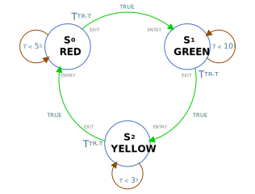
  <h3 align="center">State Diagram</h3>
</p>

<p align="center">
	 
  <h3 align="center">Wiring Diagram</h3>
</p>

#### State-Transition Table Table

|State|Id|Predicate|Next State - F|Next State - T|Process|Event|Delay Time (mS)| Timer Type|
|:-----|:-----:|:-----|:-----:|:-----:|:-----|:-----|-----:|:-----|
|`RED`|`0`|`-`|`0`|`1`|`-`|`EventOnActionChanged`|`5,000`|`TRANS_TIMER`|
|`GREEN`|`1`|`-`|`1`|`2`|`-`|`EventOnActionChanged`|`10,000`|`TRANS_TIMER`|
|`YELLOW`|`2`|`-`|`2`|`0`|`-`|`EventOnActionChanged`|`3,000`|`TRANS_TIMER`|

#### State-Transition Table Table -> Transition Declaration

```C
Transition transitions[] = {
  {nullptr, 0, 1, nullptr, EventOnActionChanged, 5000, TRANS_TIMER},                  // State-1 - NextF = 0, NextT = 1
  {nullptr, 1, 2, nullptr, EventOnActionChanged, 10000, TRANS_TIMER},                 // State-2 - NextF = 1, NextT = 2
  {nullptr, 2, 0, nullptr, EventOnActionChanged, 3000, TRANS_TIMER},                  // State-3 - NextF = 2, NextT = 0
};
const uint8_t numberOfTransitions = sizeof(transitions) / sizeof(Transition);         // Calculate the number of transitions.
```

Or,

```C
enum TraficState : id_t {
  RED,
  GREEN,
  YELLOW
};

Transition transitions[] = {
  {nullptr, RED, GREEN, nullptr, EventOnActionChanged, 5000, TRANS_TIMER},      // State-1 - NextF = 0, NextT = 1
  {nullptr, GREEN, YELLOW, nullptr, EventOnActionChanged, 10000, TRANS_TIMER},  // State-2 - NextF = 1, NextT = 2
  {nullptr, YELLOW, RED, nullptr, EventOnActionChanged, 3000, TRANS_TIMER},     // State-3 - NextF = 2, NextT = 0
};
const uint8_t numberOfTransitions = sizeof(transitions) / sizeof(Transition);   // Calculate the number of transitions.
```

#### Sketch

 [Traffic Light with Transition Timer](https://wokwi.com/projects/363517579350398977)

```C
#include "FiniteState.h"

#define redLightPin     5
#define yellowLightPin  4
#define greenLightPin   3

uint8_t lightPins[] = {redLightPin, greenLightPin, yellowLightPin}; // Define an array of light pins.
const uint8_t numberOfLights = sizeof(lightPins) / sizeof(uint8_t); // Calculate the number of lights.

void EventOnActionChanged(EventArgs e);   // Event State

enum TraficState : id_t {
  RED,
  GREEN,
  YELLOW
};

Transition transitions[] = {
  {nullptr, RED, GREEN, nullptr, EventOnActionChanged, 5000, TRANS_TIMER},      // State-1 - NextF = 0, NextT = 1
  {nullptr, GREEN, YELLOW, nullptr, EventOnActionChanged, 10000, TRANS_TIMER},  // State-2 - NextF = 1, NextT = 2
  {nullptr, YELLOW, RED, nullptr, EventOnActionChanged, 3000, TRANS_TIMER},     // State-3 - NextF = 2, NextT = 0
};
const uint8_t numberOfTransitions = sizeof(transitions) / sizeof(Transition);   // Calculate the number of transitions.

FiniteState finiteStateMachine(transitions, numberOfTransitions);               // Define Finite-State Object

void setup() {
  for (uint8_t index = 0; index < numberOfLights; index ++) {
    pinMode(lightPins[index], OUTPUT);      // Set Pin Mode
    digitalWrite(lightPins[index], LOW);    // Set Light with the LOW state.
  }
  finiteStateMachine.begin(RED);            // FSM begins with Initial Transition Id 0
}

void loop() {
  finiteStateMachine.execute();             // Execute the FSM
}

void EventOnActionChanged(EventArgs e) {
  switch (e.action) {
    case ENTRY:
      digitalWrite(lightPins[e.id], HIGH);  // Set Light with the HIGH state.
      break;
    case EXIT:
      digitalWrite(lightPins[e.id], LOW);   // Set Light with the LOW state.
      break;
  }
}
```

## Coin Operated Turnstile

- [Coin Operated Turnstile with Predicate and Process](#coin-operated-turnstile-with-predicate-and-process)

- [Coin Operated Turnstile with Predicate and Event](#coin-operated-turnstile-with-predicate-and-event)

### Coin Operated Turnstile with Predicate and Process

<p align="center">
	
  <h3 align="center">State Diagram</h3>
</p>

<p align="center">
	 
  <h3 align="center">Wiring Diagram</h3>
</p>

#### State-Transition Table Table

|State|Id|Predicate|Next State - F|Next State - T|Process|Event|Delay Time (mS)| Timer Type|
|:-----|:-----:|:-----|:-----:|:-----:|:-----|:-----|-----:|:-----|
|`LOCKED`|`0`|`CoinPredicate`|`0`|`1`|`LockedProcess`|`-`|`-`|`-`|
|`UNLOCKED`|`1`|`ArmPredicate`|`1`|`0`|`UnlockedProcess`|`-`|`-`|`-`|

#### State-Transition Table Table -> Transition Declaration

```C
Transition transitions[] = {
  {CoinPredicate, 0, 1, LockedProcess},                                       // State-0 - NextF = 0, NextT = 1
  {ArmPredicate, 1, 0, UnlockedProcess}                                       // State-1 - NextF = 1, NextT = 0
};
const uint8_t numberOfTransitions = sizeof(transitions) / sizeof(Transition); // Calculate the number of transitions.
```

Or,

```C
enum TurnstileState : id_t {
  LOCKED,
  UNLOCKED
};

Transition transitions[] = {
  {CoinPredicate, LOCKED, UNLOCKED, LockedProcess},                           // State-0 - NextF = 0, NextT = 1
  {ArmPredicate, UNLOCKED, LOCKED, UnlockedProcess}                           // State-1 - NextF = 1, NextT = 0
};
const uint8_t numberOfTransitions = sizeof(transitions) / sizeof(Transition); // Calculate the number of transitions.
```

#### Sketch

 [Coin Operated Turnstile with Predicate and Process](https://wokwi.com/projects/363765428832793601)

```C
#include "FiniteState.h"
#include "RepeatButton.h"

#define coinInputPin      A0    // Define the Coin input pin.
#define armInputPin       A1    // Define the Arm input pin.

#define lockedStatusPin   7     // Define the Locked state output pin.
#define unlockedStatusPin 6     // Define the Unlocked state output pin. 

bool CoinPredicate(id_t id);    // Declare Coin Predicate function
bool ArmPredicate(id_t id);     // Declare Arm Predicate function

void LockedProcess(id_t id);    // Declare Locked Process function
void UnlockedProcess(id_t id);  // Declare Unlocked Process function

enum TurnstileState : id_t {
  LOCKED,
  UNLOCKED
};

Transition transitions[] = {
  {CoinPredicate, LOCKED, UNLOCKED, LockedProcess},                           // State-0 - NextF = 0, NextT = 1
  {ArmPredicate, UNLOCKED, LOCKED, UnlockedProcess}                           // State-1 - NextF = 1, NextT = 0
};
const uint8_t numberOfTransitions = sizeof(transitions) / sizeof(Transition); // Calculate the number of transitions.

FiniteState coinOperatedTurnstile(transitions, numberOfTransitions);          // Finite-State Object

RepeatButton coin;                                                            // Declare the Coin RepeatButton object
RepeatButton arm;                                                             // Declare the Arm RepeatButton object

void setup() {
  coin.buttonMode(coinInputPin, INPUT_PULLUP);  // Set the Coin input pin mode
  arm.buttonMode(armInputPin, INPUT_PULLUP);    // Set the Arm input pin mode
  pinMode(lockedStatusPin, OUTPUT);             // Set the Locked state pin mode
  pinMode(unlockedStatusPin, OUTPUT);           // Set the Unlocked state pin mode

  coinOperatedTurnstile.begin(LOCKED);          // FSM begins with Initial Transition Id 0
}

void loop() {
  coin.repeatButton();                    // Executing the Coin repeat button function
  arm.repeatButton();                     // Executing the Arm repeat button function
  coinOperatedTurnstile.execute();        // Execute the FSM
}

bool CoinPredicate(id_t id) {
  return coin.isPressed();                // Predicate putting a coin.
}

bool ArmPredicate(id_t id) {
  return arm.isPressed();                // Predicate pushing the arm.
}

void LockedProcess(id_t id) {
  digitalWrite(lockedStatusPin, HIGH);    // Turn on the locked position status.
  digitalWrite(unlockedStatusPin, LOW);   // Turn off the unlocked position status.
}

void UnlockedProcess(id_t id) {
  digitalWrite(lockedStatusPin, LOW);     // Turn off the locked position status.
  digitalWrite(unlockedStatusPin, HIGH);  // Turn on the unlocked position status.
}
```

### Coin Operated Turnstile with Predicate and Event

<p align="center">
	
  <h3 align="center">State Diagram</h3>
</p>

<p align="center">
	 
  <h3 align="center">Wiring Diagram</h3>
</p>

#### State-Transition Table Table

|State|Id|Predicate|Next State - F|Next State - T|Process|Event|Delay Time (mS)| Timer Type|
|:-----|:-----:|:-----|:-----:|:-----:|:-----|:-----|-----:|:-----|
|`LOCKED`|`0`|`CoinPredicate`|`0`|`1`|`-`|`EventOnActionChanged`|`-`|`-`|
|`UNLOCKED`|`1`|`ArmPredicate`|`1`|`0`|`-`|`EventOnActionChanged`|`-`|`-`|

#### State-Transition Table Table -> Transition Declaration

```C
Transition transitions[] = {
  {inputPredicate, 0, 1, nullptr, EventOnActionChanged},                        // State-0 - NextF = 0, NextT = 1
  {inputPredicate, 1, 0, nullptr, EventOnActionChanged}                         // State-1 - NextF = 1, NextT = 0
};
const uint8_t numberOfTransitions = sizeof(transitions) / sizeof(Transition);   // Calculate the number of transitions.
```

Or,

```C
enum TurnstileState : id_t {
  LOCKED,
  UNLOCKED
};

Transition transitions[] = {
  {inputPredicate, LOCKED, UNLOCKED, nullptr, EventOnActionChanged},            // State-0 - NextF = 0, NextT = 1
  {inputPredicate, UNLOCKED, LOCKED, nullptr, EventOnActionChanged}             // State-1 - NextF = 1, NextT = 0
};
const uint8_t numberOfTransitions = sizeof(transitions) / sizeof(Transition);   // Calculate the number of transitions.
```


#### Sketch

 [Coin Operated Turnstile with Predicate and Event](https://wokwi.com/projects/363592764580637697)

```C
#include "FiniteState.h"
#include "RepeatButton.h"

#define coinInputPin      A0  // Define the Coin input pin.
#define armInputPin       A1  // Define the Push input pin.

#define lockedStatusPin   7   // Define the Locked state output pin.
#define unlockedStatusPin 6   // Define the Unlocked state output pin.

bool inputPredicate(id_t id);             // Declare Coin Predicate function
void EventOnActionChanged(EventArgs e);   // Event On Action Changed

enum TurnstileState : id_t {
  LOCKED,
  UNLOCKED
};

Transition transitions[] = {
  {inputPredicate, LOCKED, UNLOCKED, nullptr, EventOnActionChanged},            // State-0 - NextF = 0, NextT = 1
  {inputPredicate, UNLOCKED, LOCKED, nullptr, EventOnActionChanged}             // State-1 - NextF = 1, NextT = 0
};
const uint8_t numberOfTransitions = sizeof(transitions) / sizeof(Transition);   // Calculate the number of transitions.

FiniteState coinOperatedTurnstile(transitions, numberOfTransitions);            // Finite-State Object

uint8_t inputPins[numberOfTransitions] = {coinInputPin, armInputPin};           // Declare the input pin array
uint8_t outputPins[numberOfTransitions] = {lockedStatusPin, unlockedStatusPin}; // Declare the output pin array
RepeatButton turnstileInputs[numberOfTransitions];                              // Declare the Turnstile Inputs RepeatButton object

void setup() {
  for (uint8_t index = 0; index < numberOfTransitions; index++) {
    turnstileInputs[index].buttonMode(inputPins[index], INPUT_PULLUP);  // Set the Turnstile repeat button pin mode
    pinMode(outputPins[index], OUTPUT);                                 // Set the Output state pin mode
  }
  coinOperatedTurnstile.begin(LOCKED);                                  // FSM begins with Initial Transition Id 0
}

void loop() {
  for (uint8_t index = 0; index < numberOfTransitions; index++) {
    turnstileInputs[index].repeatButton();    // Executing the Turnstile repeat button function.
  }
  coinOperatedTurnstile.execute();            // Execute the FSM.
}

bool inputPredicate(id_t id) {
  return turnstileInputs[id].isPressed();     // Predicate putting a coin and pushing the arm.
}

void EventOnActionChanged(EventArgs e) {
  switch (e.action) {
    case ENTRY:
      digitalWrite(outputPins[e.id], HIGH);   // Turn on the turnstile position status.
      break;
    case EXIT:
      digitalWrite(outputPins[e.id], LOW);    // Turn off the previous turnstile position status.
      break;
  }
}
```

## Blink 

<p align="center">
	
  <h3 align="center">State Diagram</h3>
</p>

<p align="center">
	 
  <h3 align="center">Wiring Diagram</h3>
</p>

#### State-Transition Table Table

|State|Id|Predicate|Next State - F|Next State - T|Process|Event|Delay Time (mS)| Timer Type|
|:-----|:-----:|:-----|:-----:|:-----:|:-----|:-----|-----:|:-----|
|`LED_OFF`|`0`|`-`|`0`|`1`|`TurnOffProcess`|`-`|`500`|`TRANS_TIMER`|
|`LED_ON`|`1`|`-`|`1`|`0`|`TrunOnProcess`|`-`|`1,000`|`TRANS_TIMER`|

#### State-Transition Table Table -> Transition Declaration

```C
Transition transitions[] = {
  {nullptr, 0, 1, TurnOffProcess, nullptr, 500, TRANS_TIMER},                 // State-0 - NextF = 0, NextT = 1
  {nullptr, 1, 0, TrunOnProcess, nullptr, 1000, TRANS_TIMER}                  // State-1 - NextF = 1, NextT = 0
};
const uint8_t numberOfTransitions = sizeof(transitions) / sizeof(Transition); // Calculate the number of transitions.
```

Or,

```C
enum LedState : id_t {
  LED_OFF,
  LED_ON
};

Transition transitions[] = {
  {nullptr, LED_OFF, LED_ON, TurnOffProcess, nullptr, 500, TRANS_TIMER},      // State-0 - NextF = 0, NextT = 1
  {nullptr, LED_ON, LED_OFF, TrunOnProcess, nullptr, 1000, TRANS_TIMER}       // State-1 - NextF = 1, NextT = 0
};
const uint8_t numberOfTransitions = sizeof(transitions) / sizeof(Transition); // Calculate the number of transitions.
```

#### Sketch

 [Blink](https://wokwi.com/projects/363629762329468929)

```C
#include "FiniteState.h"

void TrunOnProcess(id_t id);     // Declare Turn LED On Process function
void TurnOffProcess(id_t id);    // Declare Turn LED Off Process function

enum LedState : id_t {
  LED_OFF,
  LED_ON
};

Transition transitions[] = {
  {nullptr, LED_OFF, LED_ON, TurnOffProcess, nullptr, 500, TRANS_TIMER},      // State-0 - NextF = 0, NextT = 1
  {nullptr, LED_ON, LED_OFF, TrunOnProcess, nullptr, 1000, TRANS_TIMER}       // State-1 - NextF = 1, NextT = 0
};
const uint8_t numberOfTransitions = sizeof(transitions) / sizeof(Transition); // Calculate the number of transitions.

FiniteState blinkFS(transitions, numberOfTransitions);                        // Finite-State Object

void setup() {
  pinMode(LED_BUILTIN, OUTPUT);     // Set the LED_BUILTIN pin mode
  blinkFS.begin(LED_OFF);           // FSM begins with Initial Transition Id 0
}

void loop() {
  blinkFS.execute();                // Execute the FSM
}

void TrunOnProcess(id_t id) {
  digitalWrite(LED_BUILTIN, HIGH);  // Turn on the LED.
}

void TurnOffProcess(id_t id) {
  digitalWrite(LED_BUILTIN, LOW);   // Turn off the LED.
}
```

## Debounce 

<p align="center">
	
  <h3 align="center">State Diagram</h3>
</p>

<p align="center">
	 
  <h3 align="center">Wiring Diagram</h3>
</p>

#### State-Transition Table Table

|State|Id|Predicate|Next State - F|Next State - T|Process|Event|Delay Time (mS)| Timer Type|
|:-----|:-----:|:-----|:-----:|:-----:|:-----|:-----|-----:|:-----|
|`RELEASED`|`0`|`ButtonPredicate`|`0`|`1`|`ReleasedProcess`|`-`|`-`|`-`|
|`DEBOUNCE_T`|`1`|`ButtonPredicate`|`0`|`2`|`-`|`-`|`10`|`TRUE_TIMER`|
|`PRESSED`|`2`|`ButtonPredicate`|`3`|`2`|`PressedProcess`|`-`|`-`|`-`|
|`DEBOUNCE_F`|`3`|`ButtonPredicate`|`0`|`2`|`-`|`-`|`10`|`FALSE_TIMER`|

#### State-Transition Table Table -> Transition Declaration

```C
#define debounce 10                                                             // Debounce Delay 10 milliseconds

Transition transitions[] = {
  {ButtonPredicate, 0, 1, ReleasedProcess},                                     // State-0 - NextF = 0, NextT = 1
  {ButtonPredicate, 0, 2, nullptr, nullptr, debounce, TRUE_TIMER},              // State-1 - NextF = 0, NextT = 2
  {ButtonPredicate, 3, 2, PressedProcess},                                      // State-2 - NextF = 3, NextT = 2
  {ButtonPredicate, 0, 2, nullptr, nullptr, debounce, FALSE_TIMER}              // State-3 - NextF = 0, NextT = 2
};
const uint8_t numberOfTransitions = sizeof(transitions) / sizeof(Transition);   // Calculate the number of transitions.
```

Or,

```C
enum DebounceState : id_t {
  RELEASED,
  DEBOUNCE_T,
  PRESSED,
  DEBOUNCE_F
};

#define debounce 10                                                             // Debounce Delay 10 milliseconds

Transition transitions[] = {
  {ButtonPredicate, RELEASED, DEBOUNCE_T, ReleasedProcess},                     // State-0 - NextF = 0, NextT = 1
  {ButtonPredicate, RELEASED, PRESSED, nullptr, nullptr, debounce, TRUE_TIMER}, // State-1 - NextF = 0, NextT = 2
  {ButtonPredicate, DEBOUNCE_F, PRESSED, PressedProcess},                       // State-2 - NextF = 3, NextT = 2
  {ButtonPredicate, RELEASED, PRESSED, nullptr, nullptr, debounce, FALSE_TIMER} // State-3 - NextF = 0, NextT = 2
};
const uint8_t numberOfTransitions = sizeof(transitions) / sizeof(Transition);   // Calculate the number of transitions.
```

#### Sketch

 [Debounce](https://wokwi.com/projects/363631226643958785)

```C
#include "FiniteState.h"

#define buttonPin A0  // Define the Button input pin.
#define ledPin    7   // Define the LED output pin.

bool ButtonPredicate(id_t id);  // Declare Read Button Predicate function
void ReleasedProcess(id_t id);  // Declare Released Process function
void PressedProcess(id_t id);   // Declare Pressed Process function

enum DebounceState : id_t {
  RELEASED,
  DEBOUNCE_T,
  PRESSED,
  DEBOUNCE_F
};

#define debounce 10             // Debounce Delay 10 milliseconds

Transition transitions[] = {
  {ButtonPredicate, RELEASED, DEBOUNCE_T, ReleasedProcess},                     // State-0 - NextF = 0, NextT = 1
  {ButtonPredicate, RELEASED, PRESSED, nullptr, nullptr, debounce, TRUE_TIMER}, // State-1 - NextF = 0, NextT = 2
  {ButtonPredicate, DEBOUNCE_F, PRESSED, PressedProcess},                       // State-2 - NextF = 3, NextT = 2
  {ButtonPredicate, RELEASED, PRESSED, nullptr, nullptr, debounce, FALSE_TIMER} // State-3 - NextF = 0, NextT = 2
};
const uint8_t numberOfTransitions = sizeof(transitions) / sizeof(Transition);   // Calculate the number of transitions.

FiniteState debounceFS(transitions, numberOfTransitions);                       // Finite-State Object
bool buttonState;

void setup() {
  pinMode(buttonPin, INPUT_PULLUP);   // Set the Button input mode
  pinMode(ledPin, OUTPUT);            // Set the LED output pin mode
  debounceFS.begin(RELEASED);         // FSM begins with Initial Transition Id 0
}

void loop() {
  debounceFS.execute();               // Execute the FSM
  digitalWrite(ledPin, buttonState);  // Set LED with the button State.
}

bool ButtonPredicate(id_t id) {
  return !digitalRead(buttonPin);     // Read Button value.
}

void ReleasedProcess(id_t id) {
  buttonState = false;                // Set the Button state with false value.
}

void PressedProcess(id_t id) {
  buttonState = true;                 // Set the Button state with true value.
}
```

## Analog High-Alarm

<p align="center">
	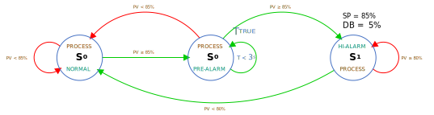
  <h3 align="center">State Diagram</h3>
</p>

<p align="center">
	 
  <h3 align="center">Wiring Diagram</h3>
</p>

#### State-Transition Table Table

|State|Id|Predicate|Next State - F|Next State - T|Process|Event|Delay Time (mS)| Timer Type|
|:-----|:-----:|:-----|:-----:|:-----:|:-----|:-----|-----:|:-----|
|`NORMAL`|`0`|`AnalogPredicate`|`0`|`1`|`NormalProcess`|`-`|`-`|`-`|
|`PRE_ALARM`|`1`|`AnalogPredicate`|`0`|`2`|`PreAlarmProcess`|`-`|`3,000`|`TRUE_TIMER`|
|`HIGH_ALARM`|`2`|`AnalogPredicate`|`2`|`0`|`HighAlarmProcess`|`-`|`-`|`-`|

#### State-Transition Table Table -> Transition Declaration

```C
#define alarmDelay 3000         // Define alarm dalay

Transition transitions[] = {
  {AnalogPredicate, 0, 1, NormalProcess},                                     // State-0 - NextF = 0, NextT = 1
  {AnalogPredicate, 0, 2, PreAlarmProcess, nullptr, alarmDelay, TRUE_TIMER},  // State-1 - NextF = 0, NextT = 2
  {AnalogPredicate, 2, 0, HighAlarmProcess}                                   // State-2 - NextF = 2, NextT = 0
};
const uint8_t numberOfTransitions = sizeof(transitions) / sizeof(Transition); // Number of Transitions
```

Or,

```C
enum AnalogState : id_t {
  NORMAL,
  PRE_ALARM,
  HIGH_ALARM
};

#define alarmDelay 3000                                                                     // Define alarm dalay

Transition transitions[] = {
  {AnalogPredicate, NORMAL, PRE_ALARM, NormalProcess},                                      // State-0 - NextF = 0, NextT = 1
  {AnalogPredicate, NORMAL, HIGH_ALARM, PreAlarmProcess, nullptr, alarmDelay, TRUE_TIMER},  // State-1 - NextF = 0, NextT = 2
  {AnalogPredicate, HIGH_ALARM, NORMAL, HighAlarmProcess}                                   // State-2 - NextF = 2, NextT = 0
};
const uint8_t numberOfTransitions = sizeof(transitions) / sizeof(Transition);               // Number of Transitions

FiniteState finiteStateMachine(transitions, numberOfTransitions);                           // Finite-State Object
```

#### Sketch

 [Analog High-Alarm](https://wokwi.com/projects/363718211450567681)

```C
#include "FiniteState.h"

#define processValuePin A0  // Define the Process value input pin.
#define normalPin       6   // Define the normal status output pin.
#define preAlarmPin     5   // Define the pre-alarm status output pin.
#define highAlarmPin    4   // Define the high-alarm status output pin.

enum Operator {
  LT,           // Less than operator
  LE,           // Less than or equal operator
  GT,           // Greater than operator
  GE            // Greater than or equal operator
};

const long setpoint = 85; // Alarm Setpoint
const long deadband = 5;  // Alarm Deadband

Operator operators [] = {GE, GE, LT};                           // Comparison operators
long setpoints [] = {setpoint, setpoint, setpoint - deadband};  // Comparison setpoints

const long AnalogRead();                                              // Declare Analog Read Function
void ProcessAlarmStatus(bool normal, bool preAlarm, bool highAlarm);  // Declare Process Alarm Status Function

long processValue;                                                    // Declare processValue variable

bool AnalogPredicate(id_t id);  // Declare analog predicate Function
void NormalProcess(id_t id);    // Declare normal process Function
void PreAlarmProcess(id_t id);  // Declare pre-alarm process Function
void HighAlarmProcess(id_t id); // Declare high-alarm process Function

enum AnalogState : id_t {
  NORMAL,
  PRE_ALARM,
  HIGH_ALARM
};

#define alarmDelay 3000                                                                     // Define alarm dalay

Transition transitions[] = {
  {AnalogPredicate, NORMAL, PRE_ALARM, NormalProcess},                                      // State-0 - NextF = 0, NextT = 1
  {AnalogPredicate, NORMAL, HIGH_ALARM, PreAlarmProcess, nullptr, alarmDelay, TRUE_TIMER},  // State-1 - NextF = 0, NextT = 2
  {AnalogPredicate, HIGH_ALARM, NORMAL, HighAlarmProcess}                                   // State-2 - NextF = 2, NextT = 0
};
const uint8_t numberOfTransitions = sizeof(transitions) / sizeof(Transition);               // Number of Transitions

FiniteState finiteStateMachine(transitions, numberOfTransitions);                           // Finite-State Object

void setup() {
  pinMode(normalPin, OUTPUT);             // Set the normal LED pin mode
  pinMode(preAlarmPin, OUTPUT);           // Set the pre-alarm LED pin mode
  pinMode(highAlarmPin, OUTPUT);          // Set the hith-alarm LED= pin mode
  finiteStateMachine.begin(NORMAL);       // FSM begins with Initial Transition Id 0
}

void loop() {
  finiteStateMachine.execute();           // Execute the FSM
  processValue = AnalogRead();            // Read processValue
}

void NormalProcess(id_t id) {
  ProcessAlarmStatus(true, false, false); // Update process alarm status
}

void PreAlarmProcess(id_t id) {
  ProcessAlarmStatus(false, true, false); // Update process alarm status
}

void HighAlarmProcess(id_t id) {
  ProcessAlarmStatus(false, true, true);  // Update process alarm status
}

bool AnalogPredicate(id_t id) {
  bool value;
  switch (operators[id]) {
    case GE:
      value = processValue >= setpoints[id];  // Compare process value with setpoint
      break;
    case LT:
      value = processValue < setpoints[id];   // Compare process value with setpoint
      break;
    default:
      value = false;
      break;
  }
  return value;
}

void ProcessAlarmStatus(bool normal, bool preAlarm, bool highAlarm) {
  digitalWrite(normalPin, normal);        // Update normal status
  digitalWrite(preAlarmPin, preAlarm);    // Update pre-alarm status
  digitalWrite(highAlarmPin, highAlarm);  // Update high-alarm status
}

const long AnalogRead() {
  long value = analogRead(processValuePin); // Read Process Value
  return map(value, 0, 1023, 0, 100);       // Scaling processValue
}
```

# References

- Wikipedia [Finite-State Machine](https://en.wikipedia.org/wiki/Finite-state_machine)

- MathWorks [Model Finite State Machines](https://www.mathworks.com/help/stateflow/gs/finite-state-machines.html)
