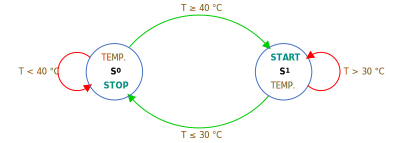
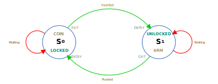

<p align="center">
	
  <h1 align="center">Finite-State Machine</h1>
</p>

# Finite-State Machine for Arduino
Finite-State provides a bounded state machine that combines `state transitions`, which has the following part:

- [Predicate Function](#predicate-function)
- [Next State](#next-state)
- [Process Function](#process-function)
- [Event Handler Function](#event-handler-function)
- [Timer](#timer)

<p align="center">
	
  <h3 align="center"></h3>
</p>

```C
typedef struct {
  Predicate predicate;                  // Predicate Function Pointer
  id_t nextF;                           // Next State on FALSE
  id_t nextT;                           // Next State on TRUE
  Process process;                      // Process Function Pointer
  EventHandler eventHandler;            // Event Function Pointer
  time_t delayTime;                     // Delay Time
  TimerType timerType;                  // Timer Type
} Transition;
```

## Predicate Function

A Predicate Function will determine whether the specified object meets the criteria.

```C
typedef bool (*Predicate)(id_t);        //  Predicate Function Pointer
```

The following function accepts `id` from a caller; type is a parameter of type `id_t`. The return type is `boolean`. It will be used to determine a Next-State for the ***current state*** and ***next state***:

Syntax:

```C
bool PredicateCallbackFunction(id_t id);  //  Predicate Callback Function
```

Example:

```C
bool PredicateCallbackFunction(id_t id) {
  // TODO: PREDICATE FUNCTION
  
  return button[id].isPressed(); 
}
```

Or,

```C
bool PredicateCallbackFunction(id_t id) {
  // TODO: PREDICATE FUNCTION
  
  return array[id] == 10; 
}
```

## Next State

A Next-State has two destinations:

  1. **Next State On FALSE (`nextF`)**

     A **nextF** will be defined by the Id number when the return value from the condition of the Timer and Predicate function is `FALSE`.

  2. **Next State On TRUE (`nextT`)** 

     A **Next State On TURE** will be defined by the Id number when the return value from the condition of the Timer and Predicate function is `TRUE`.


## Process Function

The Process Function is a function to implement Input/Output control, read/write data, etc.

```C
typedef void (*Process)(id-t);                //  Process Function Pointer
```

The following function accepts `id` from a caller; type is parameters of type `id_t`:

Syntax:

```C
void ProcessCallbackFunction(id_t id);       //  Process Callback Function
```

Example:

```C
void MotorProcess(id_t id) {
  StatusState status;

  if (motor[id].timerON) {
    if (motor[id].running) {
      status = RUNNING;
    } else {
      status = FAULT;
    }
    digitalWrite(motor[id].faultPin, status == FAULT);
  }
}
```

NOTE: The Id can also be obtained from `objectName.id`.

```C
id_t id = finiteStateMachine.id;
```

## Event Handler Function

An Event Handler Function is an option. Finite-State will handle events when the state changes for `ENTRY`, `DURINT`, and `EXIT` actions.

```C
typedef void (*EventHandler)(EventArgs);    //  Event Handler Function Pointer
```

EventArgs:

```C
typedef struct {
  id_t id;          // State id
  Action action;    // Action State
} EventArgs;
```

Action:

```C
enum Action {
  DURING,
  EXIT,
  ENTRY
};
```

The following function accepts `EventArgs` from a caller; type is the parameters of type `id_t`, and `Action`:

Syntax:

```C
void EventCallbackFunction(EventArgs e);   //  Event Callback Function
```

Example:

```C
void EvnetOnActionChanged(EventArgs e) {
  switch (e.action) {
    case ENTRY:
      digitalWrite(motor[e.id].output, true);
      break;
    case DURING:
      // TODO: SOMETHING
      break;
    case EXIT:
      digitalWrite(motor[e.id].output, false);
      break;
  }
}
```

## Timer

A Timer is an option. Finite-State will predict the condition for the next state with a timer when the timer type selects and the delay time value is greater than zero.

```c
enum TimerType {
  NOT_USED,       // Not Used Timer
  TRANS_TIMER,    // Transition Timer
  PREDIC_TIMER,   // Predicate Timer
  FALSE_TIMER,    // False State Timer
  TRUE_TIMER,     // True State Timer
};
```

### Not Used Timer (`NOT_USED`)

When Timer is not used, The condition for the next state is determined by the Predicate function's return value.

<p align="center">
	
  <h3 align="center">Not-Used Timer Next-State Flow</h3>
</p>

<p align="center">
	
  <h3 align="center">Typical Not-Used Timer State Diagram</h3>
</p>

### State-Transition Table

|Id|Predicate|Next State - F|Next State - T|Process|Event|Delay Time (mS)| Timer Type|
|:-----|:-----|:-----:|:-----:|:-----|:-----|-----:|:-----|
|0|`PredicateCallbackFunction`|0|1|`ProcessCallbackFunction`|`EventCallbackFunction`|-|-|
|1|`PredicateCallbackFunction`|1|0|`ProcessCallbackFunction`|`EventCallbackFunction`|-|-|

### State-Transition Table -> Transition Declaration

```C
Transition transitions[] = {
  {PredicateCallbackFunction, 0, 1, ProcessCallbackFunction, EventCallbackFunction},  // State-0 - NextF = 0, NextT = 1
  {PredicateCallbackFunction, 1, 0, ProcessCallbackFunction, EventCallbackFunction}   // State-1 - NextF = 1, NextT = 0
};
const uint8_t numberOfTransitions = sizeof(transitions) / sizeof(Transition);         // Number of Transitions

FiniteState finiteStateMachine(transitions, numberOfTransitions);                     // Finite-State Object
```

### Transition Timer (`TRANS_TIMER`)

When selecting the transition timer, the condition for the next state will ignore the Predicate function's return value. It is the only `NextT` condition possible during the timer timeout.

<p align="center">
	
  <h3 align="center">Transition-Timer Next-State Flow</h3>
</p>

<p align="center">
	
  <h3 align="center">Typical Transition-Timer State Diagram</h3>|
</p>

### State-Transition Table

|Id|Predicate|Next State - F|Next State - T|Process|Event|Delay Time (mS)| Timer Type|
|:-----|:-----|:-----:|:-----:|:-----|:-----|-----:|:-----|
|0|`nullptr`|0|1|`ProcessCallbackFunction`|`EventCallbackFunction`|`3,000`|`TRANS_TIMER`|
|1|`nullptr`|1|0|`ProcessCallbackFunction`|`EventCallbackFunction`|`5,000`|`TRANS_TIMER`|

### State-Transition Table -> Transition Declaration

```C
Transition transitions[] = {
  {nullptr, 0, 1, ProcessCallbackFunction, EventCallbackFunction, 3000, TRANS_TIMER},   // State-0 - NextF = 0, NextT = 1
  {nullptr, 1, 0, ProcessCallbackFunction, EventCallbackFunction, 5000, TRANS_TIMER}    // State-1 - NextF = 1, NextT = 0
};
const uint8_t numberOfTransitions = sizeof(transitions) / sizeof(Transition);           // Number of Transitions

FiniteState finiteStateMachine(transitions, numberOfTransitions);                       // Finite-State Object
```

### Predicate Timer (`PREDIC_TIMER`)

When selecting the predicate timer, the condition for the next state will ignore the Predicate function's return value during the timer running. The Predicate function's return value will be used for the state selection when the timer timeout.

<p align="center">
	
  <h3 align="center">Predicate-Timer Next-State Flow</h3>
</p>

<p align="center">
	
  <h3 align="center">Typical Predicate-Timer State Diagram</h3>
</p>

### State-Transition Table

|Id|Predicate|Next State - F|Next State - T|Process|Event|Delay Time (mS)| Timer Type|
|:-----|:-----|:-----:|:-----:|:-----|:-----|-----:|:-----|
|0|`PredicateCallbackFunction`|0|1|`ProcessCallbackFunction`|`EventCallbackFunction`|`3,000`|`PREDIC_TIMER`|
|1|`PredicateCallbackFunction`|1|0|`ProcessCallbackFunction`|`EventCallbackFunction`|`5,000`|`PREDIC_TIMER`|

### State-Transition Table -> Transition Declaration

```C
Transition transitions[] = {
  {PredicateCallbackFunction, 0, 1, ProcessCallbackFunction, EventCallbackFunction, 3000, PREDIC_TIMER},  // State-0 - NextF = 0, NextT = 1
  {PredicateCallbackFunction, 1, 0, ProcessCallbackFunction, EventCallbackFunction, 5000, PREDIC_TIMER}   // State-1 - NextF = 1, NextT = 0
};
const uint8_t numberOfTransitions = sizeof(transitions) / sizeof(Transition);                             // Number of Transitions

FiniteState finiteStateMachine(transitions, numberOfTransitions);                                         // Finite-State Object
```

### False-State Timer (`FALSE_TIMER`)

When selecting the false-state timer, the condition for the next state will ignore the Predicate function's `False` value except for the `True` deal during the timer running. The state will be accepted the "False" when the timer timeout.

<p align="center">
	
  <h3 align="center">False-Timer Next-State Flow</h3>
</p>

<p align="center">
	
  <h3 align="center">Typical False-Timer State Diagram</h3>
</p>

### State-Transition Table

|Id|Predicate|Next State - F|Next State - T|Process|Event|Delay Time (mS)| Timer Type|
|:-----|:-----|:-----:|:-----:|:-----|:-----|-----:|:-----|
|0|`PredicateCallbackFunction`|1|0|`ProcessCallbackFunction`|`EventCallbackFunction`|`3,000`|`FALSE_TIMER`|
|1|`PredicateCallbackFunction`|0|1|`ProcessCallbackFunction`|`EventCallbackFunction`|`5,000`|`FALSE_TIMER`|

### State-Transition Table -> Transition Declaration

```C
Transition transitions[] = {
  {PredicateCallbackFunction, 1, 0, ProcessCallbackFunction, EventCallbackFunction, 3000, FALSE_TIMER},   // State-0 - NextF = 1, NextT = 0
  {PredicateCallbackFunction, 0, 1, ProcessCallbackFunction, EventCallbackFunction, 5000, FALSE_TIMER}    // State-1 - NextF = 0, NextT = 1
};
const uint8_t numberOfTransitions = sizeof(transitions) / sizeof(Transition);                             // Number of Transitions

FiniteState finiteStateMachine(transitions, numberOfTransitions);                                         // Finite-State Object
```

### True-State Timer (`TRUE_TIMER`)

When selecting the true-state timer, the condition for the next state will ignore the Predicate function's `True` value except for the `False` deal during the timer running. The state will be accepted the `True` when the timer timeout.

<p align="center">
	
  <h3 align="center">True-Timer Next-State Flow</h3>
</p>

<p align="center">
	
  <h3 align="center">Typical True-Timer State Diagram</h3>
</p>

### State-Transition Table

|Id|Predicate|Next State - F|Next State - T|Process|Event|Delay Time (mS)| Timer Type|
|:-----|:-----|:-----:|:-----:|:-----|:-----|-----:|:-----|
|0|`PredicateCallbackFunction`|0|1|`ProcessCallbackFunction`|`EventCallbackFunction`|`3,000`|`TRUE_TIMER`|
|1|`PredicateCallbackFunction`|1|0|`ProcessCallbackFunction`|`EventCallbackFunction`|`5,000`|`TRUE_TIMER`|

### State-Transition Table -> Transition Declaration

```C
Transition transitions[] = {
  {PredicateCallbackFunction, 0, 1, ProcessCallbackFunction, EventCallbackFunction, 3000, TRUE_TIMER},  // State-0 - NextF = 0, NextT = 1
  {PredicateCallbackFunction, 1, 0, ProcessCallbackFunction, EventCallbackFunction, 5000, TRUE_TIMER}   // State-1 - NextF = 1, NextT = 0
};
const uint8_t numberOfTransitions = sizeof(transitions) / sizeof(Transition);                           // Number of Transitions

FiniteState finiteStateMachine(transitions, numberOfTransitions);                                       // Finite-State Object
```

# Example

## Fan Control With A Thermostat

<p align="center">
	
  <h3 align="center">State Diagram</h3>
</p>

<p align="center">
	 
  <h3 align="center">Wiring Diagram</h3>
</p>

#### State-Transition Table

|Id|Predicate|Next State - F|Next State - T|Process|Event|Delay Time (mS)| Timer Type|
|:-----|:-----|:-----:|:-----:|:-----|:-----|-----:|:-----|
|0|`FanStartPredicate`|0|1|`StartFanProcess`|-|-|-|
|1|`FanStopPredicate`|1|0|`StopFanProcess`|-|-|-|

#### State-Transition Table -> Transition Declaration

```C
Transition transitions[] = {
  {FanStartPredicate, 0, 1, StartFanProcess}, // State-0 - NextF = 0, NextT = 1
  {FanStopPredicate, 1, 0, StopFanProcess}    // State-1 - NextF = 1, NextT = 0
};
```

#### Sketch

```C
#include "FiniteState.h"

#define thermostatPin   A0
#define startStatusPin  5
#define stopStatusPin   6


uint8_t statusPins[] = {stopStatusPin, startStatusPin};
const uint8_t numberOfStatus = sizeof(statusPins) / sizeof(uint8_t);

void StartFanProcess(id_t id);
void StopFanProcess(id_t id);
bool FanStartPredicate(id_t state);
bool FanStopPredicate(id_t state);

Transition transitions[] = {
  {FanStartPredicate, 0, 1, StartFanProcess}, // State-0 - NextF = 0, NextT = 1
  {FanStopPredicate, 1, 0, StopFanProcess}    // State-1 - NextF = 1, NextT = 0
};
const uint8_t numberOfTransitions = sizeof(transitions) / sizeof(Transition);

FiniteState finiteStateMachine(transitions, numberOfTransitions); // Finite-State Object

const long ThermostatRead();
void FanControl(id_t id);

long temperature;

void setup() {
  for (uint8_t index = 0; index < numberOfStatus; index++) {
    pinMode(statusPins[index], OUTPUT);
    digitalWrite(statusPins[index], LOW);
  }

  finiteStateMachine.begin(0);    // FSM begins with Initial Transition Id 0
}

void loop() {
  finiteStateMachine.execute();   // Execute the FSM
  temperature = ThermostatRead(); // Read temperature
}

bool FanStartPredicate(id_t state) {
  return temperature >= 40;       // Determine Fan Start Action
}

void StartFanProcess(id_t id) {
  FanControl(id);                 // Fan control output
}

bool FanStopPredicate(id_t state) {
  return temperature <= 30;       // Determine Fan Stop Action
}

void StopFanProcess(id_t id) {
  FanControl(id);                 // Fan control output
}

void FanControl(id_t id) {
  for (uint8_t index = 0; index < numberOfStatus; index++) {
    bool value = index == id;
    digitalWrite(statusPins[index], value);  // Update Status
  }
}

const long ThermostatRead() {
  long value = analogRead(thermostatPin); // Read Pushbutton Value
  return map(value, 0, 1023, 0, 100);     // Scaling temperature
}
```

## Traffic Light

- [Traffic Light with Customized Timer (Timer Type: `NOT_USED`)](#traffic-light-with-customized-timer-not_used)

- [Traffic Light with Transition Timer (Timer Type: `TRANS_TIMER`)](#traffic-light-with-transition-timer-trans_timer)

### Traffic Light with Customized Timer (`NOT_USED`)

<p align="center">
	
  <h3 align="center">State Diagram</h3>
</p>

<p align="center">
	 
  <h3 align="center">Wiring Diagram</h3>
</p>

#### State-Transition Table

|Id|Predicate|Next State - F|Next State - T|Process|Event|Delay Time (mS)| Timer Type|
|:-----|:-----|:-----:|:-----:|:-----|:-----|-----:|:-----|
|0|`DelayTimePredicate`|0|1|`nullptr`|`EventOnActionChanged`|-|-|
|1|`DelayTimePredicate`|1|2|`nullptr`|`EventOnActionChanged`|-|-|
|2|`DelayTimePredicate`|2|0|`nullptr`|`EventOnActionChanged`|-|-|

#### State-Transition Table -> Transition Declaration

```C
Transition transitions[] = {
  {DelayTimePredicate, 0, 1, nullptr, EventOnActionChanged}, // State-1 - NextF = 0, NextT = 1
  {DelayTimePredicate, 1, 2, nullptr, EventOnActionChanged}, // State-2 - NextF = 1, NextT = 2
  {DelayTimePredicate, 2, 0, nullptr, EventOnActionChanged}, // State-3 - NextF = 2, NextT = 0
};
```

#### Sketch

```C
#include "FiniteState.h"

#define redLightPin     5
#define yellowLightPin  4
#define greenLightPin   3

uint8_t lightPins[] = {redLightPin, greenLightPin, yellowLightPin}; // Define an array of light pins.
const uint8_t numberOfLights = sizeof(lightPins) / sizeof(uint8_t); // Calculate the number of lights.

typedef struct {
  unsigned long delayTime;
  unsigned long startTime;
} Timer;

Timer delayTimes[] = {
  {5000},   // RED Delay Time 5 seconds
  {10000},  // GREEN Delay Time 10 seconds
  {3000},   // YELLOW Delay Time 3 seconds
};

bool DelayTimePredicate(id_t id);         // Predicate (Input)
void EventOnActionChanged(EventArgs e);   // Event State

Transition transitions[] = {
  {DelayTimePredicate, 0, 1, nullptr, EventOnActionChanged}, // State-1 - NextF = 0, NextT = 1
  {DelayTimePredicate, 1, 2, nullptr, EventOnActionChanged}, // State-2 - NextF = 1, NextT = 2
  {DelayTimePredicate, 2, 0, nullptr, EventOnActionChanged}, // State-3 - NextF = 2, NextT = 0
};
const uint8_t numberOftransitions = sizeof(transitions) / sizeof(Transition); // Calculate the number of transitions.

FiniteState finiteStateMachine(transitions, numberOftransitions);             // Define Finite-State Object

void setup() {
  for (uint8_t index = 0; index < numberOfLights; index ++) {
    pinMode(lightPins[index], OUTPUT);    // Set Pin Mode
    digitalWrite(lightPins[index], LOW);  // Set Light with the LOW state.
  }
  finiteStateMachine.begin(0);            // FSM begins with Initial Transition Id 0
}

void loop() {
  finiteStateMachine.execute();  // Execute the FSM
}

bool DelayTimePredicate(id_t id) {
  return (millis() - delayTimes[id].startTime >= delayTimes[id].delayTime); // Determine Time Delay
}

void EventOnActionChanged(EventArgs e) {
  switch (e.action) {
    case ENTRY:
      delayTimes[e.id].startTime  = millis(); // Reload start time
      digitalWrite(lightPins[e.id], HIGH);    // Set Light with the HIGH state.
      break;
    case EXIT:
      digitalWrite(lightPins[e.id], LOW);     // Set Light with the LOW state.
      break;
  }
}
```

### Traffic Light with Transition Timer (`TRANS_TIMER`)

<p align="center">
	
  <h3 align="center">State Diagram</h3>
</p>

<p align="center">
	 
  <h3 align="center">Wiring Diagram</h3>
</p>

#### State-Transition Table

|Id|Predicate|Next State - F|Next State - T|Process|Event|Delay Time (mS)| Timer Type|
|:-----|:-----|:-----:|:-----:|:-----|:-----|-----:|:-----|
|0|`nullptr`|0|1|`nullptr`|`EventOnActionChanged`|`5,000`|`TRANS_TIMER`|
|1|`nullptr`|1|2|`nullptr`|`EventOnActionChanged`|`10,000`|`TRANS_TIMER`|
|2|`nullptr`|2|0|`nullptr`|`EventOnActionChanged`|`3,000`|`TRANS_TIMER`|

#### State-Transition Table -> Transition Declaration

```C
Transition transitions[] = {
  {nullptr, 0, 1, nullptr, EventOnActionChanged, 5000, TRANS_TIMER},          // State-1 - NextF = 0, NextT = 1
  {nullptr, 1, 2, nullptr, EventOnActionChanged, 10000, TRANS_TIMER},         // State-2 - NextF = 1, NextT = 2
  {nullptr, 2, 0, nullptr, EventOnActionChanged, 3000, TRANS_TIMER},          // State-3 - NextF = 2, NextT = 0
};
```

#### Sketch

```C
#include "FiniteState.h"

#define redLightPin     5
#define yellowLightPin  4
#define greenLightPin   3

uint8_t lightPins[] = {redLightPin, greenLightPin, yellowLightPin}; // Define an array of light pins.
const uint8_t numberOfLights = sizeof(lightPins) / sizeof(uint8_t); // Calculate the number of lights.

void EventOnActionChanged(EventArgs e);  // Event State

Transition transitions[] = {
  {nullptr, 0, 1, nullptr, EventOnActionChanged, 5000, TRANS_TIMER},          // State-1 - NextF = 0, NextT = 1
  {nullptr, 1, 2, nullptr, EventOnActionChanged, 10000, TRANS_TIMER},         // State-2 - NextF = 1, NextT = 2
  {nullptr, 2, 0, nullptr, EventOnActionChanged, 3000, TRANS_TIMER},          // State-3 - NextF = 2, NextT = 0
};
const uint8_t numberOftransitions = sizeof(transitions) / sizeof(Transition); // Calculate the number of transitions.

FiniteState finiteStateMachine(transitions, numberOftransitions);             // Define Finite-State Object

void setup() {
  for (uint8_t index = 0; index < numberOfLights; index ++) {
    pinMode(lightPins[index], OUTPUT);    // Set Pin Mode
    digitalWrite(lightPins[index], LOW);  // Set Light with the LOW state.
  }
  finiteStateMachine.begin(0);            // FSM begins with Initial Transition Id 0
}

void loop() {
  finiteStateMachine.execute();  // Execute the FSM
}

void EventOnActionChanged(EventArgs e) {
  switch (e.action) {
    case ENTRY:
      digitalWrite(lightPins[e.id], HIGH);    // Set Light with the HIGH state.
      break;
    case EXIT:
      digitalWrite(lightPins[e.id], LOW);     // Set Light with the LOW state.
      break;
  }
}
```

## Coin Operated Turnstile

- [Coin Operated Turnstile with Predicate and Process](#coin-operated-turnstile-with-predicate-and-process)

- [Coin Operated Turnstile with Predicate and Event](#coin-operated-turnstile-with-predicate-and-event)

### Coin Operated Turnstile with Predicate and Process

<p align="center">
	
  <h3 align="center">State Diagram</h3>
</p>

<p align="center">
	 
  <h3 align="center">Wiring Diagram</h3>
</p>

#### State-Transition Table

|Id|Predicate|Next State - F|Next State - T|Process|Event|Delay Time (mS)| Timer Type|
|:-----|:-----|:-----:|:-----:|:-----|:-----|-----:|:-----|
|0|`CoinPredicate`|0|1|`LockedProcess`|-|-|-|
|1|`PushPredicate`|1|0|`UnlockedProcess`|-|-|-|

#### State-Transition Table -> Transition Declaration

```C
Transition transitions[] = {
  {CoinPredicate, 0, 1, LockedProcess},   // State-0 - NextF = 0, NextT = 1
  {PushPredicate, 1, 0, UnlockedProcess}  // State-1 - NextF = 1, NextT = 0
};
```

#### Sketch

```C
#include "FiniteState.h"
#include "RepeatButton.h"

#define COIN      A0  // Define the Coin input pin.
#define PUSH      A1  // Define the Push input pin.

#define LOCKED    7   // Define the Locked state output pin.
#define UNLOCKED  6   // Define the Unlocked state output pin. 

bool CoinPredicate(id_t id);              // Declare Coin Predicate function
bool PushPredicate(id_t id);              // Declare Push Predicate function

void LockedProcess(id_t id);              // Declare Locked Process function
void UnlockedProcess(id_t id);            // Declare Unlocked Process function

Transition transitions[] = {
  {CoinPredicate, 0, 1, LockedProcess},   // State-0 - NextF = 0, NextT = 1
  {PushPredicate, 1, 0, UnlockedProcess}  // State-1 - NextF = 1, NextT = 0
};
const uint8_t NumberOfTransitions = 2;    // Number Of Transitions

FiniteState coinOperatedTurnstile(transitions, NumberOfTransitions);  // Finite-State Object
RepeatButton coin;                                                    // Declare the Coin RepeatButton object
RepeatButton push;                                                    // Declare the Push RepeatButton object

void setup() {
  coin.buttonMode(COIN, INPUT_PULLUP);    // Set the Coin input pin mode
  push.buttonMode(PUSH, INPUT_PULLUP);    // Set the Push input pin mode
  pinMode(LOCKED, OUTPUT);                // Set the Locked state pin mode
  pinMode(UNLOCKED, OUTPUT);              // Set the Unlocked state pin mode

  coinOperatedTurnstile.begin(0);         // FSM begins with Initial Transition Id 0
}

void loop() {
  coin.repeatButton();                    // Executing the Coin repeat button function
  push.repeatButton();                    // Executing the Push repeat button function
  coinOperatedTurnstile.execute();        // Execute the FSM
}

bool CoinPredicate(id_t id) {
  return coin.isPressed();                // Predicate putting a coin.
}

bool PushPredicate(id_t id) {
  return push.isPressed();                // Predicate pushing the arm.
}

void LockedProcess(id_t id) {
  digitalWrite(LOCKED, HIGH);             // Turn on the locked position status.
  digitalWrite(UNLOCKED, LOW);            // Turn off the unlocked position status.
}

void UnlockedProcess(id_t id) {
  digitalWrite(LOCKED, LOW);              // Turn off the locked position status.
  digitalWrite(UNLOCKED, HIGH);           // Turn on the unlocked position status.
}
```

### Coin Operated Turnstile with Predicate and Event

<p align="center">
	
  <h3 align="center">State Diagram</h3>
</p>

<p align="center">
	 
  <h3 align="center">Wiring Diagram</h3>
</p>

#### State-Transition Table

|Id|Predicate|Next State - F|Next State - T|Process|Event|Delay Time (mS)| Timer Type|
|:-----|:-----|:-----:|:-----:|:-----|:-----|-----:|:-----|
|0|`inputPredicate`|0|1|`nullptr`|`EventOnActionChanged`|-|-|
|1|`inputPredicate`|1|0|`nullptr`|`EventOnActionChanged`|-|-|

#### State-Transition Table -> Transition Declaration

```C
 Transition transitions[] = {
  {inputPredicate, 0, 1, nullptr, EventOnActionChanged},  // State-0 - NextF = 0, NextT = 1
  {inputPredicate, 1, 0, nullptr, EventOnActionChanged}   // State-1 - NextF = 1, NextT = 0
};
```

#### Sketch

```C
#include "FiniteState.h"
#include "RepeatButton.h"

#define COIN      A0  // Define the Coin input pin.
#define PUSH      A1  // Define the Push input pin.

#define LOCKED    7   // Define the Locked state output pin.
#define UNLOCKED  6   // Define the Unlocked state output pin. 

bool inputPredicate(id_t id);             // Declare Coin Predicate function
void EventOnActionChanged(EventArgs e);   // Event On Action Changed

Transition transitions[] = {
  {inputPredicate, 0, 1, nullptr, EventOnActionChanged},  // State-0 - NextF = 0, NextT = 1
  {inputPredicate, 1, 0, nullptr, EventOnActionChanged}   // State-1 - NextF = 1, NextT = 0
};
const uint8_t NumberOfTransitions = 2;                    // Number Of Transitions

uint8_t inputPins[NumberOfTransitions] = {COIN, PUSH};                // Declare the Coin RepeatButton object
uint8_t outputPins[NumberOfTransitions] = {LOCKED, UNLOCKED};         // Declare the Coin RepeatButton object

FiniteState coinOperatedTurnstile(transitions, NumberOfTransitions);  // Finite-State Object
RepeatButton turnstileInputs[NumberOfTransitions];                    // Declare the Turnstile Inputs RepeatButton object

void setup() {
  for (uint8_t index = 0; index < NumberOfTransitions; index++) {
    turnstileInputs[index].buttonMode(inputPins[index], INPUT_PULLUP);  // Set the Turnstile repeat button pin mode
    pinMode(outputPins[index], OUTPUT);                                 // Set the Output state pin mode
  }
  coinOperatedTurnstile.begin(0);                                       // FSM begins with Initial Transition Id 0
}

void loop() {
  for (uint8_t index = 0; index < NumberOfTransitions; index++) {
    turnstileInputs[index].repeatButton();    // Executing the Turnstile repeat button function
  }
  coinOperatedTurnstile.execute();            // Execute the FSM
}

bool inputPredicate(id_t id) {
  return turnstileInputs[id].isPressed();     // Predicate putting a coin.
}

void EventOnActionChanged(EventArgs e) {
  switch (e.action) {
    case ENTRY:
      digitalWrite(outputPins[e.id], HIGH);   // Turn on the turnstile position status.
      break;
    case EXIT:
      digitalWrite(outputPins[e.id], LOW);    // Turn off the previous turnstile position status.
      break;
  }
}
```

# References

- Wikipedia [Finite-State Machine](https://en.wikipedia.org/wiki/Finite-state_machine)

- MathWorks [Model Finite State Machines](https://www.mathworks.com/help/stateflow/gs/finite-state-machines.html)
